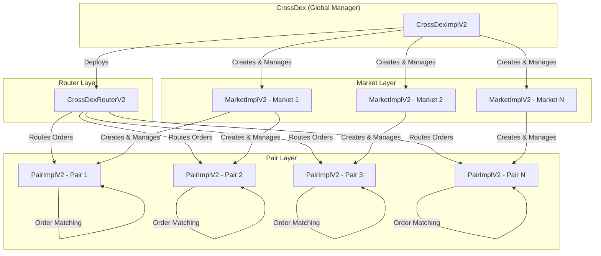

# DEX 컨트랙트 V2

유연한 오더북 매칭 엔진, 세분화된 수수료 관리, 그리고 업그레이드 가능한 아키텍처를 갖춘 Solidity 기반 탈중앙화 거래소(DEX) 스마트 컨트랙트 시스템입니다.

## 📋 목차

- [개요](#개요)
- [아키텍처](#아키텍처)
- [주요 기능](#주요-기능)
- [컨트랙트 구조](#컨트랙트-구조)
- [시작하기](#시작하기)
- [보안](#보안)
- [버전 히스토리](#버전-히스토리)
- [라이센스](#라이센스)
- [면책 조항](#면책-조항)

## 🎯 개요

DEX 컨트랙트 V2는 정교한 주문 매칭 기능을 갖춘 거래 마켓의 생성 및 관리를 가능하게 하는 고급 탈중앙화 거래소 프로토콜입니다. 시스템은 지정가 및 시장가 주문, 구성 가능한 수수료 구조를 지원하며, DeFi 거래 애플리케이션 구축을 위한 견고한 기반을 제공합니다.

크로스 체인 생태계를 위해 구축된 V2는 WETH 래퍼를 통해 네이티브 CROSS 코인 지원을 원활하게 통합하여, CROSS가 사용자 상호작용을 위한 네이티브 코인과 DEX 시스템 내의 ERC20 토큰으로 모두 작동할 수 있게 합니다.

### V2의 주요 개선사항

- **Quote당 여러 마켓**: 동일한 quote 토큰으로 여러 마켓 생성 지원, 다양한 수수료 정책 및 독립적인 마켓 관리 가능
- **세분화된 수수료 구조**: 판매자와 구매자를 위한 별도의 maker/taker 수수료, 유연한 수수료 구성 제공
- **컨트랙트 계정 화이트리스트**: 화이트리스트 기반 컨트랙트 계정 관리로 보안 강화
- **개선된 마켓 관리**: 효율적인 조회를 위한 market-to-quote 매핑으로 더 나은 마켓 추적

## 🏗️ 아키텍처

DEX 시스템은 네 가지 주요 구성 요소로 계층적 아키텍처를 따릅니다:



### 구성 요소 책임

- **CrossDexImplV2**: 마켓을 생성하고, 구현을 관리하며, 전체 DEX 생태계를 조율하는 글로벌 시스템 관리자
- **CrossDexRouterV2**: 모든 거래 작업의 진입점, 주문 라우팅 및 검증 처리
- **MarketImplV2**: 마켓 내의 거래 페어를 관리하고, 수수료를 구성하며, 페어 생성을 제어
- **PairImplV2**: 오더북을 유지하고 주문 매칭을 실행하는 핵심 거래 페어 컨트랙트

## ✨ 주요 기능

### 주문 유형

- **지정가 주문**: 선택적 시간 기반 제약 조건과 함께 특정 가격에 주문을 제출
  - Good Till Cancel (GTC)
  - Immediate Or Cancel (IOC)
  - Fill Or Kill (FOK)
- **시장가 주문**: 가능한 최상의 가격으로 즉시 실행

### 수수료 관리

V2는 네 가지 고유한 수수료율로 세분화된 수수료 구성을 제공합니다:

```solidity
struct FeeConfig {
    uint32 sellerMakerFeeBps;  // 지정가 주문을 제출하는 판매자 수수료
    uint32 sellerTakerFeeBps;   // 시장가 주문을 실행하는 판매자 수수료
    uint32 buyerMakerFeeBps;   // 지정가 주문을 제출하는 구매자 수수료
    uint32 buyerTakerFeeBps;   // 시장가 주문을 실행하는 구매자 수수료
}
```

이를 통해 다음과 같은 정교한 수수료 전략이 가능합니다:
- Maker 리베이트 (음수 maker 수수료)
- 매수 vs 매도 주문에 대한 서로 다른 수수료율
- 지정가 vs 시장가 주문에 대한 별도 수수료율

### 보안 기능

- **UUPS 업그레이드 가능**: 모든 컨트랙트는 향후 개선을 위한 업그레이드 가능한 프록시 패턴 사용
- **재진입 방지**: 모든 상태 변경 함수에 포괄적인 재진입 방지 가드
- **컨트랙트 계정 제어**: 컨트랙트 상호작용을 위한 화이트리스트 기반 관리
- **접근 제어**: 중요 작업에 대한 역할 기반 권한

### 마켓 유연성

- **Quote당 여러 마켓**: 동일한 quote 토큰을 사용하여 독립적인 마켓 생성
- **커스텀 수수료 정책**: 각 마켓은 자체 수수료 구조를 가질 수 있음
- **독립적인 관리**: 마켓별로 별도의 소유자 및 수수료 수집자

### 네이티브 코인 (CROSS) 지원

V2는 특수 WETH 래퍼 컨트랙트를 통해 크로스 체인 네이티브 코인(CROSS)에 대한 원활한 지원을 제공합니다:

- **자동 래핑**: `payable` 함수를 통해 전송된 네이티브 CROSS는 페어 작업을 위해 자동으로 ERC20으로 래핑됩니다
- **자동 언래핑**: CROSS가 페어가 아닌 주소(예: 사용자 지갑)로 전송되면 자동으로 네이티브 CROSS 코인으로 언래핑됩니다
- **투명한 사용자 경험**: 사용자는 수동 래핑/언래핑 없이 네이티브 코인으로 CROSS와 상호작용할 수 있습니다
- **ERC20 호환성**: 페어 내에서 CROSS는 오더북 작업을 위한 표준 ERC20 토큰으로 작동합니다

## 📦 컨트랙트 구조

### 핵심 컨트랙트

#### `CrossDexImplV2`

DEX 시스템의 주요 진입점입니다. 마켓 생성 및 시스템 전반의 구성을 관리합니다.

**주요 함수:**
- `createMarket()`: 새로운 거래 마켓 생성
- `allMarkets()`: 시스템의 모든 마켓 조회
- `setPairImpl()` / `setMarketImpl()`: 구현 컨트랙트 업데이트

#### `CrossDexRouterV2`

라우터는 모든 거래 작업을 처리하며 사용자를 위한 주요 인터페이스 역할을 합니다.

**주요 함수:**
- `submitBuyLimit()` / `submitSellLimit()`: 지정가 주문 제출
- `submitBuyMarket()` / `submitSellMarket()`: 시장가 주문 제출
- `cancelOrder()`: 대기 중인 주문 취소
- `getRequiredBuyVolume()`: 수수료를 포함한 필요 거래량 계산

**기능:**
- 구매 주문에 대한 자동 수수료 계산
- 컨트랙트 계정 화이트리스트
- WETH 래퍼를 통한 네이티브 토큰(CROSS) 지원

#### `WETH (CROSS)`

크로스 체인 네이티브 코인(CROSS)을 위한 특수 래퍼 컨트랙트입니다.

**주요 동작:**
- **페어 내부**: CROSS는 페어 내에서 ERC20 토큰으로 처리됩니다
- **외부 전송**: CROSS가 페어가 아닌 주소(예: 사용자 지갑)로 전송되면 자동으로 네이티브 CROSS 코인으로 언래핑됩니다
- **원활한 통합**: 사용자는 `payable` 함수를 통해 네이티브 CROSS를 직접 전송할 수 있으며, 자동으로 래핑됩니다

**작동 방식:**
```solidity
// 사용자가 트랜잭션과 함께 네이티브 CROSS 전송
router.submitBuyLimit{value: amount}(pair, price, amount, ...);

// 라우터가 페어 작업을 위해 CROSS를 ERC20으로 래핑
CROSS.mintTo{value: amount}(pair); // 페어 내부에서 ERC20으로 래핑됨

// 페어가 CROSS를 사용자 지갑으로 전송할 때
// WETH가 자동으로 언래핑: ERC20 소각 → 네이티브 CROSS 전송
```

이 이중 모드 동작을 통해 CROSS는 다음과 같이 원활하게 작동할 수 있습니다:
- DEX 시스템 내의 ERC20 토큰으로 (페어 잔액, 오더북용)
- 사용자 상호작용을 위한 네이티브 코인으로 (수동 래핑/언래핑 불필요)

#### `MarketImplV2`

특정 마켓의 거래 페어 및 수수료 구성을 관리합니다.

**주요 함수:**
- `createPair()`: 새로운 거래 페어(BASE/QUOTE) 생성
- `setMarketFees()`: 수수료 구조 구성
- `setFeeCollector()`: 수수료 수집 주소 설정

**V2 개선사항:**
- 4-파라미터 수수료 구성 (V1의 단일 수수료 대비)
- 수수료 구조 검증 (taker 수수료 ≥ maker 수수료)

#### `PairImplV2`

오더북을 유지하고 매칭을 실행하는 핵심 거래 페어입니다.

**주요 함수:**
- `submitLimitOrder()`: 오더북에 주문 추가
- `submitMarketOrder()`: 주문 즉시 실행
- `cancelOrder()`: 오더북에서 주문 제거
- `findPrevPrice()`: 지정가 주문을 위한 가격 발견

**오더북 구조:**
- 매도 주문: 가격 오름차순 정렬 (최상가 먼저)
- 매수 주문: 가격 내림차순 정렬 (최상가 먼저)
- 동일 가격 레벨 내에서 FIFO 매칭

## 🚀 시작하기

### 필수 요구사항

- [Foundry](https://book.getfoundry.sh/getting-started/installation) (최신 버전)
- Solidity ^0.8.28

### 설치

```bash
# 저장소 클론
git clone https://github.com/to-nexus/dex-contracts.git
cd dex-contracts

# 의존성 설치 (Foundry 사용)
forge soldeer install
git submodule update --init

# 컨트랙트 빌드
forge build

# 테스트 실행
forge test
```

### 프로젝트 구조

```
dex-contracts/
├── src/
│   ├── CrossDexImplV2.sol      # 메인 시스템 컨트랙트
│   ├── CrossDexRouterV2.sol     # 거래 라우터
│   ├── MarketImplV2.sol         # 마켓 관리
│   ├── PairImplV2.sol           # 거래 페어 및 오더북
│   ├── interfaces/              # 컨트랙트 인터페이스
│   └── lib/                     # 유틸리티 라이브러리
├── test/                        # 테스트 파일
├── script/                       # 배포 스크립트
└── docs-v1/                     # V1 문서
```

### 구성

프로젝트는 `foundry.toml`의 다음 주요 설정으로 Foundry를 사용합니다:

- **Optimizer**: 활성화 (33333 runs)
- **Solidity Version**: 0.8.28
- **Dependencies**: OpenZeppelin Contracts 5.2.0

### 테스트

```bash
# 모든 테스트 실행
forge test

# 가스 보고서와 함께 실행
forge test --gas-report

# 특정 테스트 파일 실행
forge test --match-path test/DEXV2Contract.t.sol

# 상세 출력과 함께 실행
forge test -vvv
```

## 🔒 보안

보안은 DEX 컨트랙트의 최우선 과제입니다. 시스템은 전문 보안 감사를 거쳤습니다.

### 감사 보고서

- **V2 감사 보고서**: 상세한 보안 분석은 `audits/AUDIT_REPORT_V2.md`를 참조하세요

### 보안 모범 사례

- 모든 컨트랙트는 OpenZeppelin의 검증된 업그레이드 가능한 컨트랙트 사용
- 포괄적인 입력 검증
- 모든 상태 변경 함수에 재진입 방지
- 관리 기능에 대한 접근 제어
- OpenZeppelin의 Math 라이브러리를 사용한 안전한 수학 연산


## 📚 버전 히스토리

### 버전 2 (현재)

**주요 개선사항:**
- Quote 토큰당 여러 마켓 지원
- 세분화된 수수료 구조 (4개의 별도 수수료율)
- 컨트랙트 계정 화이트리스트
- 개선된 market-to-quote 매핑
- 향상된 수수료 검증 및 관리

**Breaking Changes:**
- 마켓 생성 API 변경 (`feeBps` 파라미터 대신 `feeData`)
- 수수료 구조가 단일 값에서 4-파라미터 구성으로 이동

### 버전 1

V1에 대한 자세한 정보는 [`docs-v1/`](./docs-v1/) 디렉토리를 참조하세요.

**주요 V1 기능:**
- 기본 오더북 매칭
- 마켓당 단일 수수료율
- Quote 토큰당 하나의 마켓
- 표준 지정가 및 시장가 주문

## 📄 라이센스

이 프로젝트는 Business Source License 1.1 (BUSL-1.1)에 따라 라이센스가 부여됩니다. 자세한 내용은 [LICENSE](./LICENSE) 파일을 참조하세요.

**라이센스 조건:**
- **Licensor**: Nexus Co., Ltd.
- **Change Date**: 2029-10-29
- **Change License**: MIT License (Change Date 이후)

Change Date까지 이 라이센스는 다음을 허용합니다:
- 복사 및 수정
- 파생 작품 생성
- 재배포
- 비프로덕션 사용


## ⚠️ 면책 조항

이 소프트웨어는 "있는 그대로" 제공되며 보증 없이 제공됩니다. 프로덕션에서 사용하기 전에 사용자는 자체 감사 및 보안 검토를 수행해야 합니다.

