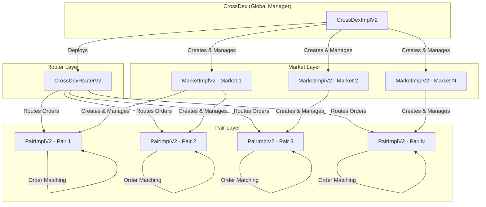

# DEX Contracts V2

A decentralized exchange (DEX) smart contract system built on Solidity, featuring a flexible order book matching engine, granular fee management, and upgradeable architecture.

## 📋 Table of Contents

- [Overview](#overview)
- [Architecture](#architecture)
- [Key Features](#key-features)
- [Contract Structure](#contract-structure)
- [Getting Started](#getting-started)
- [Security](#security)
- [Version History](#version-history)
- [License](#license)
- [Disclaimer](#disclaimer)

## 🎯 Overview

DEX Contracts V2 is an advanced decentralized exchange protocol that enables the creation and management of trading markets with sophisticated order matching capabilities. The system supports limit and market orders, configurable fee structures, and provides a robust foundation for building DeFi trading applications.

Built for the Cross Chain ecosystem, V2 seamlessly integrates native CROSS coin support through a WETH wrapper, allowing CROSS to function as both a native coin for user interactions and an ERC20 token within the DEX system.

### Key Improvements in V2

- **Multiple Markets per Quote**: Support for creating multiple markets with the same quote token, enabling different fee policies and independent market management
- **Granular Fee Structure**: Separate maker/taker fees for sellers and buyers, providing flexible fee configurations
- **Contract Account Whitelisting**: Enhanced security with whitelist-based contract account management
- **Improved Market Management**: Better market tracking with market-to-quote mapping for efficient lookups

## 🏗️ Architecture

The DEX system follows a hierarchical architecture with four main components:



### Component Responsibilities

- **CrossDexImplV2**: Global system manager that creates markets, manages implementations, and coordinates the entire DEX ecosystem
- **CrossDexRouterV2**: Entry point for all trading operations, handles order routing and validation
- **MarketImplV2**: Manages trading pairs within a market, configures fees, and controls pair creation
- **PairImplV2**: Core trading pair contract that maintains order books and executes order matching

## ✨ Key Features

### Order Types

- **Limit Orders**: Place orders at specific prices with optional time-in-force constraints
  - Good Till Cancel (GTC)
  - Immediate Or Cancel (IOC)
  - Fill Or Kill (FOK)
- **Market Orders**: Execute immediately at the best available price

### Fee Management

V2 introduces granular fee configuration with four distinct fee rates:

```solidity
struct FeeConfig {
    uint32 sellerMakerFeeBps;  // Fee for sellers who place limit orders
    uint32 sellerTakerFeeBps;   // Fee for sellers who execute market orders
    uint32 buyerMakerFeeBps;   // Fee for buyers who place limit orders
    uint32 buyerTakerFeeBps;   // Fee for buyers who execute market orders
}
```

This allows for sophisticated fee strategies, such as:
- Maker rebates (negative maker fees)
- Different rates for buy vs sell orders
- Separate rates for limit vs market orders

### Security Features

- **UUPS Upgradeable**: All contracts use upgradeable proxy pattern for future enhancements
- **Reentrancy Protection**: Comprehensive reentrancy guards on all state-changing functions
- **Contract Account Control**: Whitelist-based management for contract interactions
- **Access Control**: Role-based permissions for critical operations

### Market Flexibility

- **Multiple Markets per Quote**: Create independent markets using the same quote token
- **Custom Fee Policies**: Each market can have its own fee structure
- **Independent Management**: Separate owners and fee collectors per market

### Native Coin (CROSS) Support

V2 includes seamless support for the Cross Chain native coin (CROSS) through a special WETH wrapper contract:

- **Automatic Wrapping**: Native CROSS sent via `payable` functions is automatically wrapped to ERC20 for pair operations
- **Automatic Unwrapping**: When CROSS is transferred to non-pair addresses (e.g., user wallets), it automatically unwraps to native CROSS coin
- **Transparent User Experience**: Users can interact with CROSS as a native coin without manual wrapping/unwrapping
- **ERC20 Compatibility**: Within pairs, CROSS functions as a standard ERC20 token for order book operations

## 📦 Contract Structure

### Core Contracts

#### `CrossDexImplV2`

The main entry point for the DEX system. Manages market creation and system-wide configurations.

**Key Functions:**
- `createMarket()`: Create a new trading market
- `allMarkets()`: Retrieve all markets in the system
- `setPairImpl()` / `setMarketImpl()`: Update implementation contracts

#### `CrossDexRouterV2`

The router handles all trading operations and serves as the primary interface for users.

**Key Functions:**
- `submitBuyLimit()` / `submitSellLimit()`: Place limit orders
- `submitBuyMarket()` / `submitSellMarket()`: Place market orders
- `cancelOrder()`: Cancel pending orders
- `getRequiredBuyVolume()`: Calculate required volume including fees

**Features:**
- Automatic fee calculation for buy orders
- Contract account whitelisting
- Native token (CROSS) support via WETH wrapper

#### `WETH (CROSS)`

Special wrapper contract for the Cross Chain native coin (CROSS).

**Key Behavior:**
- **Pair Internal**: CROSS is treated as an ERC20 token within pairs
- **External Transfers**: When CROSS is transferred to addresses other than pairs (e.g., user wallets), it automatically unwraps to native CROSS coin
- **Seamless Integration**: Users can send native CROSS directly via `payable` functions, and it will be wrapped automatically

**How It Works:**
```solidity
// User sends native CROSS with transaction
router.submitBuyLimit{value: amount}(pair, price, amount, ...);

// Router wraps CROSS to ERC20 for pair operations
CROSS.mintTo{value: amount}(pair); // Wrapped as ERC20 inside pair

// When pair transfers CROSS to user wallet
// WETH automatically unwraps: burn ERC20 → send native CROSS
```

This dual-mode behavior allows CROSS to work seamlessly both as:
- An ERC20 token within the DEX system (for pair balances, order books)
- A native coin for user interactions (no manual wrapping/unwrapping needed)

#### `MarketImplV2`

Manages trading pairs and fee configuration for a specific market.

**Key Functions:**
- `createPair()`: Create a new trading pair (BASE/QUOTE)
- `setMarketFees()`: Configure fee structure
- `setFeeCollector()`: Set fee collection address

**Improvements in V2:**
- 4-parameter fee configuration (vs single fee in V1)
- Fee structure validation (taker fee ≥ maker fee)

#### `PairImplV2`

Core trading pair that maintains order books and executes matching.

**Key Functions:**
- `submitLimitOrder()`: Add order to order book
- `submitMarketOrder()`: Execute order immediately
- `cancelOrder()`: Remove order from order book
- `findPrevPrice()`: Price discovery for limit orders

**Order Book Structure:**
- Sell orders: Ascending price order (best price first)
- Buy orders: Descending price order (best price first)
- FIFO matching within the same price level

## 🚀 Getting Started

### Prerequisites

- [Foundry](https://book.getfoundry.sh/getting-started/installation) (latest version)
- Solidity ^0.8.28

### Installation

```bash
# Clone the repository
git clone https://github.com/to-nexus/dex-contracts.git
cd dex-contracts

# Install dependencies (using Foundry)
forge soldeer install
git submodule update --init

# Build contracts
forge build

# Run tests
forge test
```

### Project Structure

```
dex-contracts/
├── src/
│   ├── CrossDexImplV2.sol      # Main system contract
│   ├── CrossDexRouterV2.sol     # Trading router
│   ├── MarketImplV2.sol         # Market management
│   ├── PairImplV2.sol           # Trading pair & order book
│   ├── interfaces/              # Contract interfaces
│   └── lib/                     # Utility libraries
├── test/                        # Test files
├── script/                       # Deployment scripts
└── docs-v1/                     # V1 documentation
```

### Configuration

The project uses Foundry with the following key settings (from `foundry.toml`):

- **Optimizer**: Enabled (33333 runs)
- **Solidity Version**: 0.8.28
- **Dependencies**: OpenZeppelin Contracts 5.2.0

### Testing

```bash
# Run all tests
forge test

# Run with gas reporting
forge test --gas-report

# Run specific test file
forge test --match-path test/DEXV2Contract.t.sol

# Run with verbosity
forge test -vvv
```

## 🔒 Security

Security is a top priority for the DEX contracts. The system has undergone professional security audits.

### Audit Reports

- **V2 Audit Report**: See `audits/AUDIT_REPORT_V2.md` for detailed security analysis

### Security Best Practices

- All contracts use OpenZeppelin's battle-tested upgradeable contracts
- Comprehensive input validation
- Reentrancy protection on all state-changing functions
- Access control for administrative functions
- Safe math operations using OpenZeppelin's Math library


## 📚 Version History

### Version 2 (Current)

**Major Improvements:**
- Multiple markets per quote token support
- Granular fee structure (4 separate fee rates)
- Contract account whitelisting
- Improved market-to-quote mapping
- Enhanced fee validation and management

**Breaking Changes:**
- Market creation API changed (`feeData` parameter instead of `feeBps`)
- Fee structure moved from single value to 4-parameter configuration

### Version 1

For detailed information about V1, please refer to the [`docs-v1/`](./docs-v1/) directory.

**Key V1 Features:**
- Basic order book matching
- Single fee rate per market
- One market per quote token
- Standard limit and market orders

## 📄 License

This project is licensed under the Business Source License 1.1 (BUSL-1.1). See the [LICENSE](./LICENSE) file for details.

**License Terms:**
- **Licensor**: Nexus Co., Ltd.
- **Change Date**: 2029-10-29
- **Change License**: MIT License (after Change Date)

Until the Change Date, this license permits:
- Copying and modification
- Creating derivative works
- Redistribution
- Non-production use


## ⚠️ Disclaimer

This software is provided "as is" without warranty. Users should conduct their own audits and security reviews before using in production.
