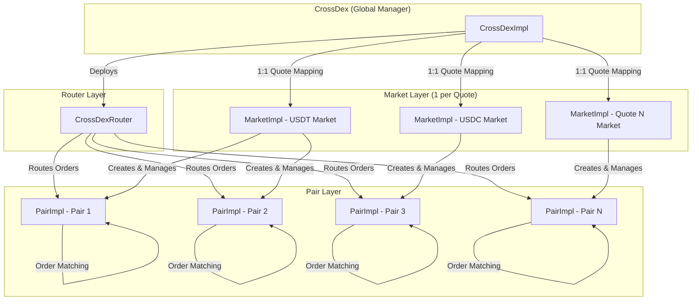
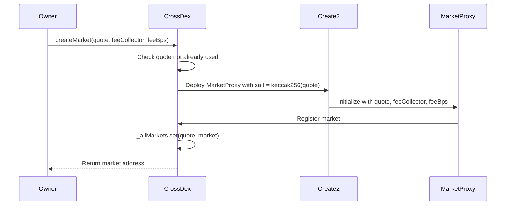
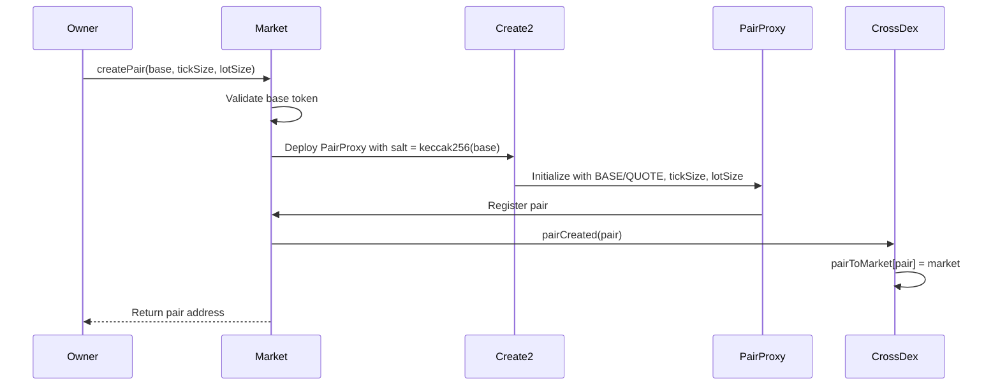
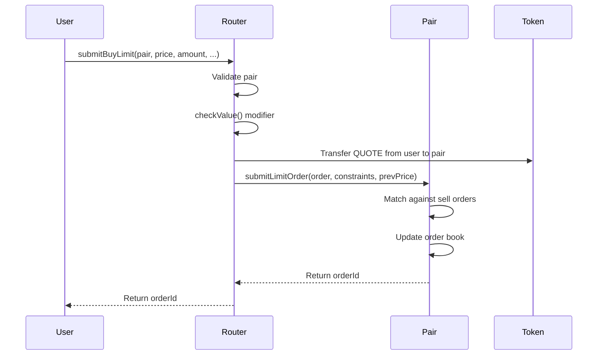
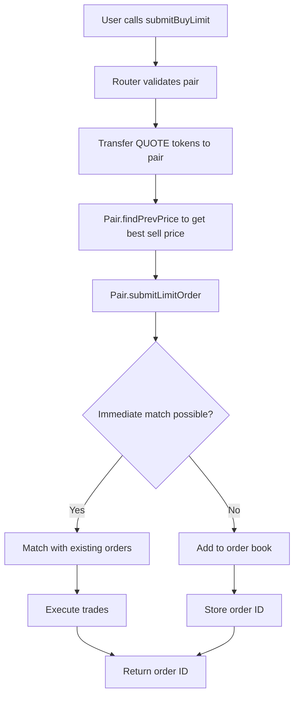
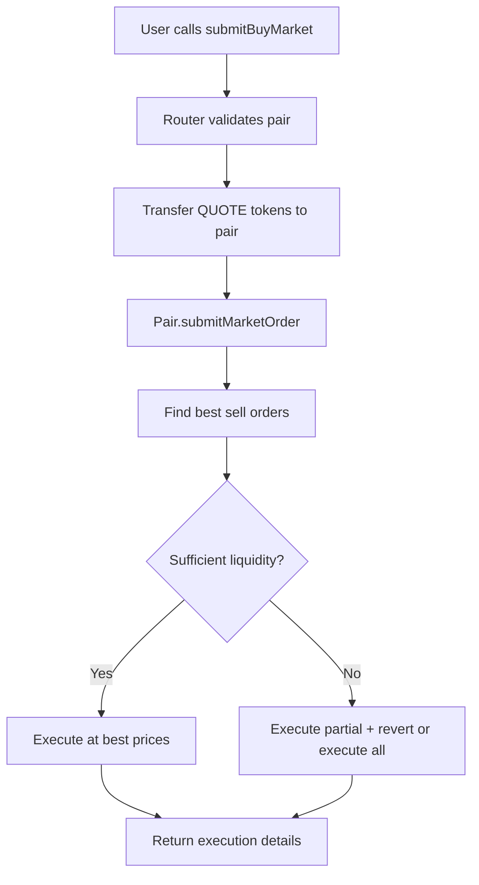
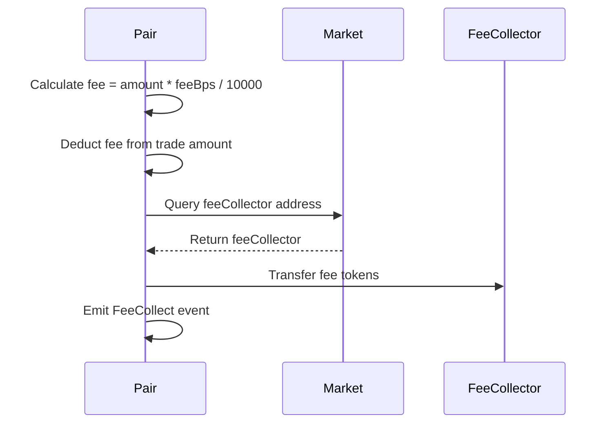

# DEX 컨트랙트 V1

DEX 스마트 컨트랙트 시스템의 원본 버전입니다. 이 문서는 V1의 아키텍처, 기능 및 제한사항을 다룹니다.

## 📋 목차

- [개요](#개요)
- [아키텍처](#아키텍처)
- [주요 기능](#주요-기능)
- [컨트랙트 구조](#컨트랙트-구조)
- [데이터 구조](#데이터-구조)
- [컨트랙트 계층](#컨트랙트-계층)
- [주문 흐름](#주문-흐름)
- [수수료 수집](#수수료-수집)
- [스토리지 레이아웃](#스토리지-레이아웃)
- [보안 고려사항](#보안-고려사항)
- [성능 고려사항](#성능-고려사항)
- [제한사항](#제한사항)

## 🎯 개요

DEX 컨트랙트 V1은 탈중앙화 거래소 프로토콜의 기초 버전입니다. 지정가 및 시장가 주문으로 오더북 매칭, 마켓당 단일 수수료율, 그리고 quote 토큰과 마켓 간의 간단한 1:1 관계를 제공합니다.

크로스 체인 생태계를 위해 구축된 V1은 WETH 래퍼 컨트랙트를 통해 네이티브 CROSS 코인 지원을 포함하여, CROSS가 사용자 상호작용을 위한 네이티브 코인과 DEX 시스템 내의 ERC20 토큰으로 모두 작동할 수 있게 합니다.

### 디자인 철학

V1은 단순성을 염두에 두고 설계되었습니다:
- **Quote당 하나의 마켓**: 각 quote 토큰은 하나의 마켓만 가질 수 있음
- **단일 수수료율**: 모든 거래(매수/매도, maker/taker)가 동일한 수수료 비율 사용
- **컨트랙트 계정 제한**: 컨트랙트 계정은 라우터와의 상호작용이 제한됨
- **직관적인 API**: 간단하고 이해하기 쉬운 함수 시그니처
- **네이티브 CROSS 지원**: WETH 래퍼를 통한 크로스 체인 네이티브 코인(CROSS)의 원활한 통합

## 🏗️ 아키텍처

V1 시스템은 네 가지 주요 구성 요소로 계층적 아키텍처를 따릅니다:



### 시스템 디자인

- **마켓 매핑**: V1은 `quote => market` 매핑(1:1 관계)을 사용합니다
- **마켓 생성**: 각 quote 토큰은 정확히 하나의 마켓을 가질 수 있습니다
- **수수료 구조**: V1은 모든 거래에 단일 `feeBps` 값을 사용합니다

## ✨ 주요 기능

### 주문 유형

V1은 다음 주문 유형을 지원합니다:

- **지정가 주문**: 선택적 시간 기반 제약 조건과 함께 특정 가격에 주문 제출
  - Good Till Cancel (GTC)
  - Immediate Or Cancel (IOC)
  - Fill Or Kill (FOK)
- **시장가 주문**: 가능한 최상의 가격으로 즉시 실행

### 수수료 관리

V1은 간단한 단일 수수료율 시스템을 사용합니다:

```solidity
uint32 public feeBps; // BPS: basis point (1/10000)
```

- **단일 수수료율**: 모든 거래가 동일한 수수료 비율을 사용합니다
- **마켓 레벨 구성**: 각 마켓은 자체 수수료율을 가집니다
- **간단한 관리**: 이해하고 구성하기 쉽습니다

### 보안 기능

- **UUPS 업그레이드 가능**: 모든 컨트랙트가 업그레이드 가능한 프록시 패턴을 사용합니다
- **재진입 방지**: 포괄적인 재진입 가드
- **컨트랙트 계정 제한**: 컨트랙트 계정이 라우터 상호작용에서 차단됩니다
- **접근 제어**: 중요 작업에 대한 역할 기반 권한

### 네이티브 코인 (CROSS) 지원

V1은 특수 WETH 래퍼 컨트랙트를 통해 크로스 체인 네이티브 코인(CROSS)에 대한 원활한 지원을 제공합니다:

- **자동 래핑**: `payable` 함수를 통해 전송된 네이티브 CROSS는 페어 작업을 위해 자동으로 ERC20으로 래핑됩니다
- **자동 언래핑**: CROSS가 페어가 아닌 주소(예: 사용자 지갑)로 전송되면 자동으로 네이티브 CROSS 코인으로 언래핑됩니다
- **투명한 사용자 경험**: 사용자는 수동 래핑/언래핑 없이 네이티브 코인으로 CROSS와 상호작용할 수 있습니다
- **ERC20 호환성**: 페어 내에서 CROSS는 오더북 작업을 위한 표준 ERC20 토큰으로 작동합니다

## 📦 컨트랙트 구조

### 핵심 컨트랙트

#### `CrossDexImpl`

V1 DEX 시스템의 주요 진입점입니다. 1:1 quote-to-market 매핑으로 마켓 생성을 관리합니다.

**주요 함수:**
- `createMarket(address _owner, address quote, address feeCollector, uint256 feeBps)`: 새로운 거래 마켓 생성(quote당 하나)
- `allMarkets()`: (quotes, markets) 배열로 모든 마켓 조회
- `quoteToMarket(address quote)`: 특정 quote 토큰에 대한 마켓 가져오기

**주요 특징:**
- `_allMarkets`: `quote => market` 매핑을 가진 `EnumerableMap.AddressToAddressMap`
- 중복 quote 마켓 생성 시도 시 `CrossDexAlreadyCreatedMarketQuote` 오류 발생
- Create2 salt 생성에 `quote` 주소만 사용

#### `CrossDexRouter`

V1의 모든 거래 작업을 처리합니다. 사용자를 위한 간단한 인터페이스를 제공합니다.

**주요 함수:**
- `submitBuyLimit()` / `submitSellLimit()`: 지정가 주문 제출
- `submitBuyMarket()` / `submitSellMarket()`: 시장가 주문 제출
- `cancelOrder()`: 대기 중인 주문 취소

**보안 수정자:**
- `checkValue()`: 실행 후 라우터에 네이티브 토큰이 남아있지 않음을 보장
- 모든 컨트랙트 계정 차단(화이트리스트 기능 없음)

#### `WETH (CROSS)`

크로스 체인 네이티브 코인(CROSS)을 위한 특수 래퍼 컨트랙트입니다.

**주요 동작:**
- **페어 내부**: CROSS는 페어 내에서 ERC20 토큰으로 처리됩니다
- **외부 전송**: CROSS가 페어가 아닌 주소(예: 사용자 지갑)로 전송되면 자동으로 네이티브 CROSS 코인으로 언래핑됩니다
- **원활한 통합**: 사용자는 `payable` 함수를 통해 네이티브 CROSS를 직접 전송할 수 있으며, 자동으로 래핑됩니다

**작동 방식:**
```solidity
// 사용자가 트랜잭션과 함께 네이티브 CROSS 전송
router.submitBuyLimit{value: amount}(pair, price, amount, ...);

// 라우터가 페어 작업을 위해 CROSS를 ERC20으로 래핑
CROSS.mintTo{value: amount}(pair); // 페어 내부에서 ERC20으로 래핑됨

// 페어가 CROSS를 사용자 지갑으로 전송할 때
// WETH가 자동으로 언래핑: ERC20 소각 → 네이티브 CROSS 전송
```

이 이중 모드 동작을 통해 CROSS는 다음과 같이 원활하게 작동할 수 있습니다:
- DEX 시스템 내의 ERC20 토큰으로 (페어 잔액, 오더북용)
- 사용자 상호작용을 위한 네이티브 코인으로 (수동 래핑/언래핑 불필요)

#### `MarketImpl`

특정 마켓의 거래 페어 및 수수료 구성을 관리합니다.

**주요 함수:**
- `createPair(address base, uint256 tickSize, uint256 lotSize)`: 새로운 거래 페어 생성
- `setFeeCollector(address _feeCollector)`: 수수료 수집 주소 설정
- `setFeeBps(uint256 _feeBps)`: 단일 수수료율 설정

**수수료 관리:**
- 모든 거래에 사용되는 단일 `feeBps` 값
- maker/taker 또는 buyer/seller 수수료 간 구분 없음

#### `PairImpl`

오더북을 유지하고 매칭을 실행하는 핵심 거래 페어입니다.

**주요 함수:**
- `submitLimitOrder()`: 오더북에 주문 추가
- `submitMarketOrder()`: 주문 즉시 실행
- `cancelOrder()`: 오더북에서 주문 제거
- `findPrevPrice()`: 지정가 주문을 위한 가격 발견

## 📊 데이터 구조

### CrossDexImpl 스토리지

```solidity
address payable public ROUTER;              // 불변 라우터 주소
address public marketImpl;                  // 마켓 구현
address public pairImpl;                    // 페어 구현
EnumerableMap.AddressToAddressMap private _allMarkets; // quote => market
mapping(address pair => address) public pairToMarket;   // pair => market
address public tickSizeSetter;              // Tick size setter 주소
```

**주요 매핑:**
- `_allMarkets`: `quote 주소 => market 주소` (1:1 관계)
- `pairToMarket`: `pair 주소 => market 주소` (다대일)

### MarketImpl 스토리지

```solidity
ICrossDex public CROSS_DEX;                // 불변 CrossDex 참조
address public QUOTE;                      // 불변 quote 토큰
address public ROUTER;                     // 불변 라우터 주소
address public pairImpl;                   // 페어 구현
address public feeCollector;               // 수수료 수집 주소
uint32 public feeBps;                     // 단일 수수료율 (BPS)
EnumerableMap.AddressToAddressMap private _allPairs; // base => pair
```

**주요 매핑:**
- `_allPairs`: `base 토큰 => pair 컨트랙트` (1:1 관계)

### PairImpl 스토리지

```solidity
address public MARKET;                     // 불변 마켓 주소
address public ROUTER;                    // 불변 라우터 주소
IERC20 public BASE;                        // 불변 base 토큰
IERC20 public QUOTE;                       // 불변 quote 토큰
uint256 public DENOMINATOR;                // 10 ** BASE.decimals()

// 오더북 스토리지
uint256 private _orderIdCounter;
List.U256[2] private _prices;              // [0: sell, 1: buy]
mapping(uint256 price => List.U256) private _sellOrders; // price => order IDs
mapping(uint256 price => List.U256) private _buyOrders;  // price => order IDs
mapping(uint256 orderId => Order) private _allOrders;
mapping(address account => uint256[2]) private _accountReserves; // [BASE, QUOTE]
```

**오더북 구조:**
- 매도 주문: 가격 오름차순 정렬
- 매수 주문: 가격 내림차순 정렬
- 동일 가격: FIFO 순서(시간순)

## 🏛️ 컨트랙트 계층

### 계층 1: CrossDexImpl

**책임**: 글로벌 시스템 관리

**주요 함수:**
- `createMarket()`: quote 토큰에 대한 새로운 마켓 생성
- `allMarkets()`: 모든 quote-market 페어 나열
- `quoteToMarket()`: quote 토큰에 대한 마켓 가져오기
- `isMarket()`: 주소가 유효한 마켓인지 확인

**마켓 생성 흐름:**



### 계층 2: MarketImpl

**책임**: 마켓 레벨 관리 및 페어 생성

**주요 함수:**
- `createPair()`: 새로운 거래 페어(BASE/QUOTE) 생성
- `setFeeCollector()`: 수수료 수집 주소 업데이트
- `setFeeBps()`: 수수료율 업데이트

**페어 생성 흐름:**



### 계층 3: Router (CrossDexRouter)

**책임**: 주문 라우팅 및 검증

**주요 함수:**
- `submitBuyLimit()` / `submitSellLimit()`: 지정가 주문 제출
- `submitBuyMarket()` / `submitSellMarket()`: 시장가 주문 제출
- `cancelOrder()`: 대기 중인 주문 취소

**주문 제출 흐름:**



### 계층 4: PairImpl

**책임**: 오더북 관리 및 매칭

**주요 함수:**
- `submitLimitOrder()`: 오더북에 주문 추가
- `submitMarketOrder()`: 최상가에서 즉시 실행
- `cancelOrder()`: 오더북에서 주문 제거
- `findPrevPrice()`: 지정가 주문 삽입을 위한 최상가 찾기

## 🔄 주문 흐름

### 지정가 주문 흐름



### 시장가 주문 흐름



### 주문 매칭 알고리즘

1. **가격 발견**: 최상의 매칭 가격 찾기
2. **수량 계산**: 거래 가능한 수량 계산
3. **수수료 계산**: 마켓 수수료율 적용
4. **예약 업데이트**: 사용자 예약 업데이트
5. **주문 업데이트**: 매칭된 주문 업데이트 또는 제거
6. **이벤트 발생**: OrderMatched 이벤트 발생

## 💰 수수료 수집

### CROSS (네이티브 코인) 처리

V1은 크로스 체인 네이티브 코인(CROSS)을 위한 특수 WETH 래퍼 컨트랙트를 사용합니다. 이를 통해 CROSS는 DEX 시스템 내에서 ERC20 토큰으로 작동하고, 외부 전송을 위한 네이티브 코인으로도 작동할 수 있습니다.

**CROSS 작동 방식:**

1. **페어 내부 작업**: CROSS는 페어에 예치될 때 ERC20 토큰으로 래핑됩니다
   ```solidity
   // 사용자가 네이티브 CROSS 전송
   router.submitBuyLimit{value: amount}(...);
   
   // 라우터가 페어를 위해 ERC20으로 래핑
   CROSS.mintTo{value: amount}(pair); // 페어 내부에 ERC20 토큰 생성
   ```

2. **외부 전송**: CROSS가 페어가 아닌 주소로 전송되면 자동으로 언래핑됩니다
   ```solidity
   // 페어가 CROSS를 사용자 지갑으로 전송
   // WETH 컨트랙트가 자동으로:
   // 1. ERC20 토큰 소각
   // 2. 네이티브 CROSS 코인을 사용자에게 전송
   ```

3. **원활한 사용자 경험**: 사용자는 CROSS를 수동으로 래핑/언래핑할 필요가 없습니다
   - 네이티브 CROSS 전송 → 페어 작업을 위해 자동 래핑
   - 페어에서 수신 → 네이티브 코인으로 자동 언래핑

**주요 이점:**
- DEX 시스템 내에서 일관된 ERC20 인터페이스
- 최종 사용자를 위한 네이티브 코인 경험
- 수동 래핑/언래핑 불필요

### 수수료 구조

V1은 간단한 단일 수수료율을 사용합니다:

```solidity
uint32 public feeBps; // 예: 30 = 0.3%
```

### 수수료 수집 흐름



### 수수료 계산 예제

```solidity
// 예제: 0.3% 수수료로 1000 USDT 상당의 토큰 거래
uint256 tradeAmount = 1000 * 10**18; // 1000 USDT
uint32 feeBps = 30;                   // 0.3%

uint256 fee = (tradeAmount * feeBps) / 10000;
// fee = (1000 * 10^18 * 30) / 10000 = 3 * 10^18 USDT

uint256 amountAfterFee = tradeAmount - fee;
// 사용자가 받는 금액: 997 USDT 상당의 토큰
// 수수료 수집자가 받는 금액: 3 USDT
```

## 📦 스토리지 레이아웃

### 스토리지 슬롯 (PairImpl)

V1은 업그레이드 가능성을 유지하기 위해 일부 값에 스토리지 슬롯을 사용합니다:

```solidity
// 스토리지 슬롯 (keccak256을 사용하여 계산)
bytes32 private constant _matchedPriceSlot = 0xfd0e...;
bytes32 private constant _feeCollectorSlot = 0xd6aa...;
bytes32 private constant _feeBpsSlot = 0x1d2f...;
```

**스토리지 슬롯을 사용하는 이유:**
- 업그레이드 중 스토리지 충돌 방지
- 구현 컨트랙트의 안전한 수정 허용
- 버전 간 호환성 유지

### 스토리지 갭 패턴

모든 컨트랙트는 향후 확장을 위해 스토리지 갭을 사용합니다:

```solidity
// CrossDexImpl
uint256[44] __gap;

// MarketImpl
uint256[41] __gap;

// PairImpl
uint256[32] __gap;

// Router
uint256[45] __gap;
```

**목적:**
- 향후 변수를 위한 스토리지 슬롯 예약
- 업그레이드 중 스토리지 충돌 방지
- 새로운 상태 변수를 안전하게 추가할 수 있도록 허용

## 🔐 보안 고려사항

### 접근 제어

1. **소유권**: 소유자만 마켓을 생성하고 구현을 설정할 수 있습니다
2. **마켓 소유자**: 각 마켓은 페어 생성을 위한 자체 소유자를 가집니다
3. **라우터 검증**: 라우터가 모든 페어 주소를 검증합니다
4. **마켓 검증**: 등록된 마켓만 페어를 생성할 수 있습니다

### 재진입 방지

모든 상태 변경 함수는 `nonReentrant` 수정자를 사용합니다:

```solidity
function submitBuyLimit(...) external payable nonReentrant validPair(pair) checkValue returns (uint256) {
    // 주문 제출 로직
}
```

### 입력 검증

모든 입력에 대한 포괄적인 검증:

- 주소 확인(제로 주소 아님)
- 수량 확인(0보다 큼)
- 가격 확인(유효한 범위 내)
- 페어 검증(등록되어 있어야 함)

## 🚀 성능 고려사항

### 가스 최적화

1. **스토리지 패킹**: 효율적인 스토리지 레이아웃
2. **List 라이브러리**: 효율적인 오더북 작업을 위한 커스텀 List 라이브러리
3. **가격 발견**: 최적화된 가격 검색 알고리즘
4. **배치 작업**: 하나의 트랜잭션에서 여러 주문 취소

### 확장성

1. **오더북**: 대용량 오더북을 위한 효율적인 데이터 구조
2. **매칭 알고리즘**: 고빈도 거래에 최적화
3. **가스 한도**: 매칭 횟수 및 취소 작업에 대한 구성 가능한 한도

## ⚠️ 제한사항

### 1. Quote 토큰당 하나의 마켓

**문제**: 각 quote 토큰당 하나의 마켓만 생성할 수 있습니다.

```solidity
// V1: USDT에 대한 마켓이 이미 존재하면 이것은 revert됩니다
crossDex.createMarket(owner, USDT, feeCollector, feeBps);
crossDex.createMarket(owner, USDT, feeCollector2, differentFeeBps); // ❌ Reverts
```

**영향**: 동일한 quote 토큰을 사용하여 다른 수수료 정책을 가진 여러 마켓을 생성할 수 없습니다.

### 2. 단일 수수료율

**문제**: 주문 유형이나 측면에 관계없이 모든 거래가 동일한 수수료 비율을 사용합니다.

```solidity
// V1: 단일 수수료가 모든 거래에 적용됨
uint32 feeBps = 30; // 모든 거래에 대해 0.3%: maker, taker, buy, sell
```

**영향**: maker 리베이트를 구현하거나 거래 유형별로 수수료를 차별화할 수 없습니다.

### 3. 컨트랙트 계정 제한

**문제**: 컨트랙트 계정이 라우터와 상호작용할 수 없습니다(화이트리스트 없음).

```solidity
// V1 Router
modifier checkValue() {
    _;
    if (address(this).balance != 0) revert RouterInvalidValue();
}
// 화이트리스트 없음 - 모든 컨트랙트 차단
```

**영향**: 스마트 컨트랙트가 DEX와 직접 상호작용할 수 없어 구성 가능성이 제한됩니다.

### 4. Market-to-Quote 매핑

**문제**: 마켓 조회는 quote 토큰을 알아야 합니다.

```solidity
// V1: 마켓을 찾으려면 quote를 알아야 함
address market = crossDex.quoteToMarket(quote);
```

**영향**: 마켓 발견 및 관리가 덜 유연합니다.

## 📚 관련 문서

- [MIGRATION.md](./MIGRATION.ko.md) - 마이그레이션 가이드

## 🔒 보안

V1 컨트랙트는 보안 모범 사례를 따릅니다:
- OpenZeppelin 업그레이드 가능한 컨트랙트
- 포괄적인 입력 검증
- 재진입 방지
- 접근 제어

## 📄 라이센스

메인 프로젝트와 동일: Business Source License 1.1 (BUSL-1.1)

---

