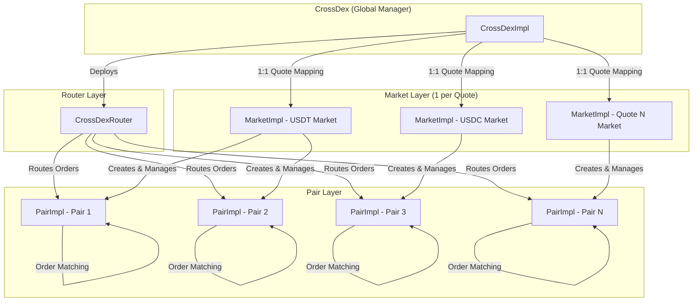
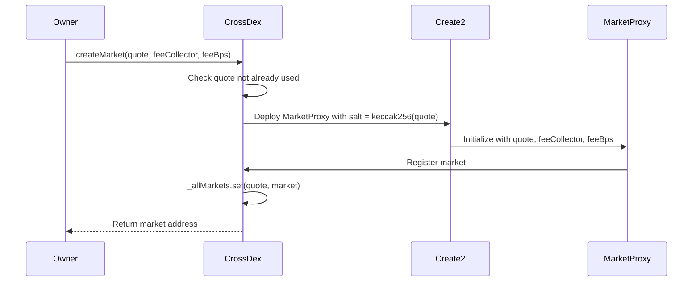
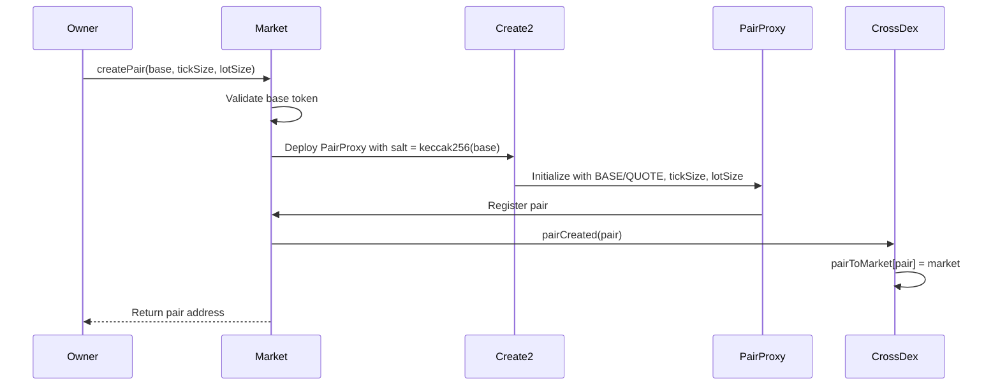
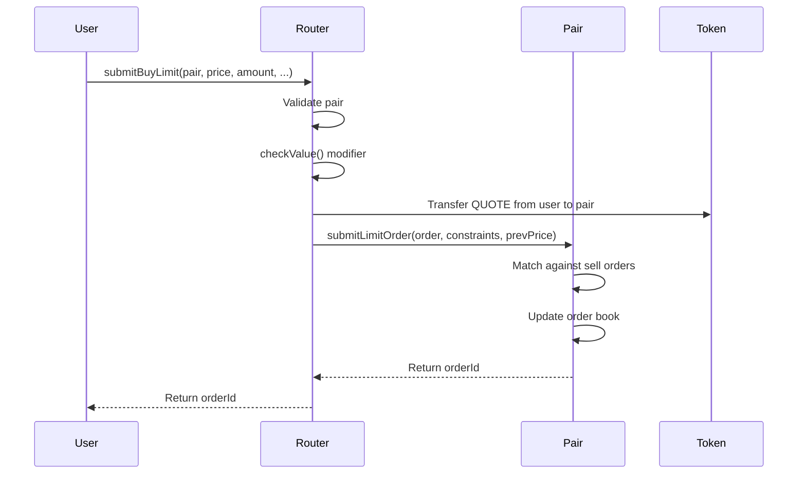
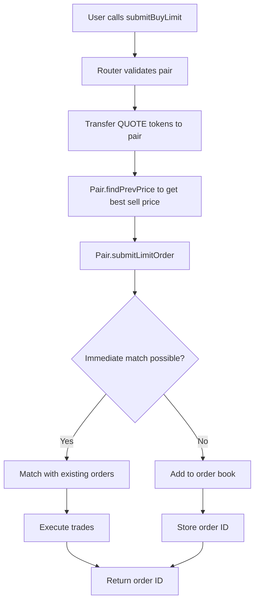
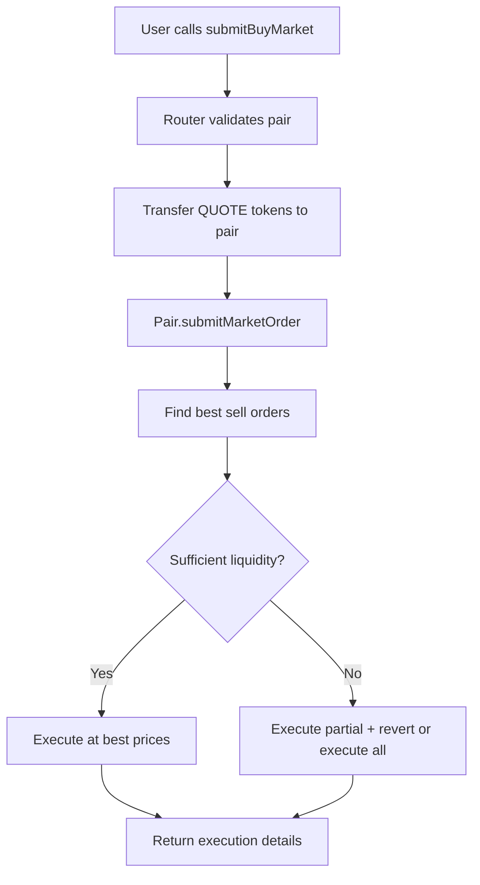
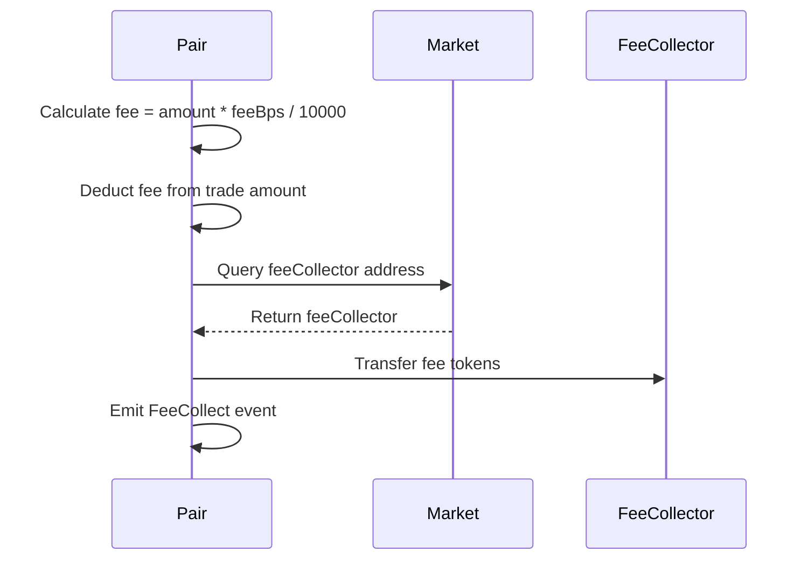

# DEX Contracts V1

The original version of the DEX smart contract system. This documentation covers the architecture, features, and limitations of V1.

## 📋 Table of Contents

- [Overview](#overview)
- [Architecture](#architecture)
- [Key Features](#key-features)
- [Contract Structure](#contract-structure)
- [Data Structures](#data-structures)
- [Contract Hierarchy](#contract-hierarchy)
- [Order Flow](#order-flow)
- [Fee Collection](#fee-collection)
- [Storage Layout](#storage-layout)
- [Security Considerations](#security-considerations)
- [Performance Considerations](#performance-considerations)
- [Limitations](#limitations)

## 🎯 Overview

DEX Contracts V1 is the foundational version of the decentralized exchange protocol. It provides a solid base for order book matching with limit and market orders, single fee rate per market, and a simple 1:1 relationship between quote tokens and markets.

Built for the Cross Chain ecosystem, V1 includes native CROSS coin support through a WETH wrapper contract, allowing CROSS to function as both a native coin for user interactions and an ERC20 token within the DEX system.

### Design Philosophy

V1 was designed with simplicity in mind:
- **One Market per Quote**: Each quote token can only have one market
- **Single Fee Rate**: All trades (buy/sell, maker/taker) use the same fee percentage
- **Contract Account Restriction**: Contract accounts are restricted from interacting with the router
- **Straightforward API**: Simple and easy-to-understand function signatures
- **Native CROSS Support**: Seamless integration of Cross Chain native coin (CROSS) via WETH wrapper

## 🏗️ Architecture

The V1 system follows a hierarchical architecture with four main components:



### System Design

- **Market Mapping**: V1 uses `quote => market` mapping (1:1 relationship)
- **Market Creation**: Each quote token can have exactly one market
- **Fee Structure**: V1 uses a single `feeBps` value for all trades

## ✨ Key Features

### Order Types

V1 supports the following order types:

- **Limit Orders**: Place orders at specific prices with optional time-in-force constraints
  - Good Till Cancel (GTC)
  - Immediate Or Cancel (IOC)
  - Fill Or Kill (FOK)
- **Market Orders**: Execute immediately at the best available price

### Fee Management

V1 uses a simple single fee rate system:

```solidity
uint32 public feeBps; // BPS: basis point (1/10000)
```

- **Single Fee Rate**: All trades use the same fee percentage
- **Market-Level Configuration**: Each market has its own fee rate
- **Simple Management**: Easy to understand and configure

### Security Features

- **UUPS Upgradeable**: All contracts use upgradeable proxy pattern
- **Reentrancy Protection**: Comprehensive reentrancy guards
- **Contract Account Restriction**: Contract accounts are blocked from router interactions
- **Access Control**: Role-based permissions for critical operations

### Native Coin (CROSS) Support

V1 includes seamless support for the Cross Chain native coin (CROSS) through a special WETH wrapper contract:

- **Automatic Wrapping**: Native CROSS sent via `payable` functions is automatically wrapped to ERC20 for pair operations
- **Automatic Unwrapping**: When CROSS is transferred to non-pair addresses (e.g., user wallets), it automatically unwraps to native CROSS coin
- **Transparent User Experience**: Users can interact with CROSS as a native coin without manual wrapping/unwrapping
- **ERC20 Compatibility**: Within pairs, CROSS functions as a standard ERC20 token for order book operations

## 📦 Contract Structure

### Core Contracts

#### `CrossDexImpl`

The main entry point for the V1 DEX system. Manages market creation with 1:1 quote-to-market mapping.

**Key Functions:**
- `createMarket(address _owner, address quote, address feeCollector, uint256 feeBps)`: Create a new trading market (one per quote)
- `allMarkets()`: Retrieve all markets as (quotes, markets) arrays
- `quoteToMarket(address quote)`: Get the market for a specific quote token

**Key Characteristics:**
- `_allMarkets`: `EnumerableMap.AddressToAddressMap` with `quote => market` mapping
- `CrossDexAlreadyCreatedMarketQuote` error if attempting to create duplicate quote markets
- Uses `quote` address alone for Create2 salt generation

#### `CrossDexRouter`

Handles all trading operations in V1. Provides a simple interface for users.

**Key Functions:**
- `submitBuyLimit()` / `submitSellLimit()`: Place limit orders
- `submitBuyMarket()` / `submitSellMarket()`: Place market orders
- `cancelOrder()`: Cancel pending orders

**Security Modifiers:**
- `checkValue()`: Ensures no native tokens remain in router after execution
- Blocks all contract accounts (no whitelist feature)

#### `WETH (CROSS)`

Special wrapper contract for the Cross Chain native coin (CROSS).

**Key Behavior:**
- **Pair Internal**: CROSS is treated as an ERC20 token within pairs
- **External Transfers**: When CROSS is transferred to addresses other than pairs (e.g., user wallets), it automatically unwraps to native CROSS coin
- **Seamless Integration**: Users can send native CROSS directly via `payable` functions, and it will be wrapped automatically

**How It Works:**
```solidity
// User sends native CROSS with transaction
router.submitBuyLimit{value: amount}(pair, price, amount, ...);

// Router wraps CROSS to ERC20 for pair operations
CROSS.mintTo{value: amount}(pair); // Wrapped as ERC20 inside pair

// When pair transfers CROSS to user wallet
// WETH automatically unwraps: burn ERC20 → send native CROSS
```

This dual-mode behavior allows CROSS to work seamlessly both as:
- An ERC20 token within the DEX system (for pair balances, order books)
- A native coin for user interactions (no manual wrapping/unwrapping needed)

#### `MarketImpl`

Manages trading pairs and fee configuration for a specific market.

**Key Functions:**
- `createPair(address base, uint256 tickSize, uint256 lotSize)`: Create a new trading pair
- `setFeeCollector(address _feeCollector)`: Set fee collection address
- `setFeeBps(uint256 _feeBps)`: Set the single fee rate

**Fee Management:**
- Single `feeBps` value used for all trades
- No distinction between maker/taker or buyer/seller fees

#### `PairImpl`

Core trading pair that maintains order books and executes matching.

**Key Functions:**
- `submitLimitOrder()`: Add order to order book
- `submitMarketOrder()`: Execute order immediately
- `cancelOrder()`: Remove order from order book
- `findPrevPrice()`: Price discovery for limit orders

## 📊 Data Structures

### CrossDexImpl Storage

```solidity
address payable public ROUTER;              // Immutable router address
address public marketImpl;                  // Market implementation
address public pairImpl;                    // Pair implementation
EnumerableMap.AddressToAddressMap private _allMarkets; // quote => market
mapping(address pair => address) public pairToMarket;   // pair => market
address public tickSizeSetter;              // Tick size setter address
```

**Key Mapping:**
- `_allMarkets`: `quote address => market address` (1:1 relationship)
- `pairToMarket`: `pair address => market address` (many:1)

### MarketImpl Storage

```solidity
ICrossDex public CROSS_DEX;                // Immutable CrossDex reference
address public QUOTE;                      // Immutable quote token
address public ROUTER;                     // Immutable router address
address public pairImpl;                   // Pair implementation
address public feeCollector;               // Fee collection address
uint32 public feeBps;                     // Single fee rate (BPS)
EnumerableMap.AddressToAddressMap private _allPairs; // base => pair
```

**Key Mapping:**
- `_allPairs`: `base token => pair contract` (1:1 relationship)

### PairImpl Storage

```solidity
address public MARKET;                     // Immutable market address
address public ROUTER;                    // Immutable router address
IERC20 public BASE;                        // Immutable base token
IERC20 public QUOTE;                       // Immutable quote token
uint256 public DENOMINATOR;                // 10 ** BASE.decimals()

// Order book storage
uint256 private _orderIdCounter;
List.U256[2] private _prices;              // [0: sell, 1: buy]
mapping(uint256 price => List.U256) private _sellOrders; // price => order IDs
mapping(uint256 price => List.U256) private _buyOrders;  // price => order IDs
mapping(uint256 orderId => Order) private _allOrders;
mapping(address account => uint256[2]) private _accountReserves; // [BASE, QUOTE]
```

**Order Book Structure:**
- Sell orders: Sorted by price (ascending)
- Buy orders: Sorted by price (descending)
- Same price: FIFO ordering (chronological)

## 🏛️ Contract Hierarchy

### Layer 1: CrossDexImpl

**Responsibility**: Global system management

**Key Functions:**
- `createMarket()`: Create new market for a quote token
- `allMarkets()`: List all quote-market pairs
- `quoteToMarket()`: Get market for a quote token
- `isMarket()`: Verify if address is a valid market

**Market Creation Flow:**



### Layer 2: MarketImpl

**Responsibility**: Market-level management and pair creation

**Key Functions:**
- `createPair()`: Create new trading pair (BASE/QUOTE)
- `setFeeCollector()`: Update fee collection address
- `setFeeBps()`: Update fee rate

**Pair Creation Flow:**



### Layer 3: Router (CrossDexRouter)

**Responsibility**: Order routing and validation

**Key Functions:**
- `submitBuyLimit()` / `submitSellLimit()`: Submit limit orders
- `submitBuyMarket()` / `submitSellMarket()`: Submit market orders
- `cancelOrder()`: Cancel pending orders

**Order Submission Flow:**



### Layer 4: PairImpl

**Responsibility**: Order book management and matching

**Key Functions:**
- `submitLimitOrder()`: Add order to order book
- `submitMarketOrder()`: Execute immediately at best price
- `cancelOrder()`: Remove order from order book
- `findPrevPrice()`: Find best price for limit order insertion

## 🔄 Order Flow

### Limit Order Flow



### Market Order Flow



### Order Matching Algorithm

1. **Price Discovery**: Find best matching price
2. **Amount Calculation**: Calculate tradeable amount
3. **Fee Calculation**: Apply market fee rate
4. **Reserve Update**: Update user reserves
5. **Order Update**: Update or remove matched orders
6. **Event Emission**: Emit OrderMatched event

## 💰 Fee Collection

### CROSS (Native Coin) Handling

V1 uses a special WETH wrapper contract for the Cross Chain native coin (CROSS). This allows CROSS to function as both an ERC20 token within the DEX system and as a native coin for external transfers.

**How CROSS Works:**

1. **Pair Internal Operations**: CROSS is wrapped as an ERC20 token when deposited into pairs
   ```solidity
   // User sends native CROSS
   router.submitBuyLimit{value: amount}(...);
   
   // Router wraps to ERC20 for pair
   CROSS.mintTo{value: amount}(pair); // Creates ERC20 tokens inside pair
   ```

2. **External Transfers**: When CROSS is transferred to non-pair addresses, it automatically unwraps
   ```solidity
   // Pair transfers CROSS to user wallet
   // WETH contract automatically:
   // 1. Burns ERC20 tokens
   // 2. Sends native CROSS coin to user
   ```

3. **Seamless User Experience**: Users don't need to manually wrap/unwrap CROSS
   - Send native CROSS → automatically wrapped for pair operations
   - Receive from pair → automatically unwrapped to native coin

**Key Benefits:**
- Consistent ERC20 interface within DEX system
- Native coin experience for end users
- No manual wrapping/unwrapping required

### Fee Structure

V1 uses a simple single fee rate:

```solidity
uint32 public feeBps; // e.g., 30 = 0.3%
```

### Fee Collection Flow



### Fee Calculation Example

```solidity
// Example: Trade 1000 USDT worth of tokens at 0.3% fee
uint256 tradeAmount = 1000 * 10**18; // 1000 USDT
uint32 feeBps = 30;                   // 0.3%

uint256 fee = (tradeAmount * feeBps) / 10000;
// fee = (1000 * 10^18 * 30) / 10000 = 3 * 10^18 USDT

uint256 amountAfterFee = tradeAmount - fee;
// User receives: 997 USDT worth of tokens
// Fee collector receives: 3 USDT
```

## 📦 Storage Layout

### Storage Slots (PairImpl)

V1 uses storage slots for some values to maintain upgradeability:

```solidity
// Storage slots (calculated using keccak256)
bytes32 private constant _matchedPriceSlot = 0xfd0e...;
bytes32 private constant _feeCollectorSlot = 0xd6aa...;
bytes32 private constant _feeBpsSlot = 0x1d2f...;
```

**Why Storage Slots?**
- Prevents storage collision during upgrades
- Allows safe modification of implementation contracts
- Maintains compatibility across versions

### Storage Gap Pattern

All contracts use storage gaps for future expansion:

```solidity
// CrossDexImpl
uint256[44] __gap;

// MarketImpl
uint256[41] __gap;

// PairImpl
uint256[32] __gap;

// Router
uint256[45] __gap;
```

**Purpose:**
- Reserve storage slots for future variables
- Prevent storage collision during upgrades
- Allow adding new state variables safely

## 🔐 Security Considerations

### Access Control

1. **Ownership**: Only owner can create markets and set implementations
2. **Market Owner**: Each market has its own owner for pair creation
3. **Router Validation**: Router validates all pair addresses
4. **Market Validation**: Only registered markets can create pairs

### Reentrancy Protection

All state-changing functions use `nonReentrant` modifier:

```solidity
function submitBuyLimit(...) external payable nonReentrant validPair(pair) checkValue returns (uint256) {
    // Order submission logic
}
```

### Input Validation

Comprehensive validation for all inputs:

- Address checks (not zero address)
- Amount checks (greater than zero)
- Price checks (within valid range)
- Pair validation (must be registered)

## 🚀 Performance Considerations

### Gas Optimization

1. **Storage Packing**: Efficient storage layout
2. **List Library**: Custom List library for efficient order book operations
3. **Price Discovery**: Optimized price search algorithms
4. **Batch Operations**: Cancel multiple orders in one transaction

### Scalability

1. **Order Book**: Efficient data structures for large order books
2. **Matching Algorithm**: Optimized for high-frequency trading
3. **Gas Limits**: Configurable limits for match counts and cancel operations

## ⚠️ Limitations

### 1. One Market per Quote Token

**Issue**: Only one market can be created per quote token.

```solidity
// V1: This will revert if a market already exists for USDT
crossDex.createMarket(owner, USDT, feeCollector, feeBps);
crossDex.createMarket(owner, USDT, feeCollector2, differentFeeBps); // ❌ Reverts
```

**Impact**: Cannot create multiple markets with different fee policies using the same quote token.

### 2. Single Fee Rate

**Issue**: All trades use the same fee percentage, regardless of order type or side.

```solidity
// V1: Single fee applies to all trades
uint32 feeBps = 30; // 0.3% for all: maker, taker, buy, sell
```

**Impact**: Cannot implement maker rebates or differentiate fees by trade type.

### 3. Contract Account Restriction

**Issue**: Contract accounts cannot interact with the router (no whitelist).

```solidity
// V1 Router
modifier checkValue() {
    _;
    if (address(this).balance != 0) revert RouterInvalidValue();
}
// No whitelist - all contracts blocked
```

**Impact**: Smart contracts cannot directly interact with the DEX, limiting composability.

### 4. Market-to-Quote Mapping

**Issue**: Market lookup requires knowing the quote token.

```solidity
// V1: Must know quote to find market
address market = crossDex.quoteToMarket(quote);
```

**Impact**: Less flexible market discovery and management.

## 📚 Related Documentation

- [MIGRATION.md](./MIGRATION.md) - Migration guide

## 🔒 Security

V1 contracts follow security best practices:
- OpenZeppelin upgradeable contracts
- Comprehensive input validation
- Reentrancy protection
- Access control

## 📄 License

Same as main project: Business Source License 1.1 (BUSL-1.1)

---

