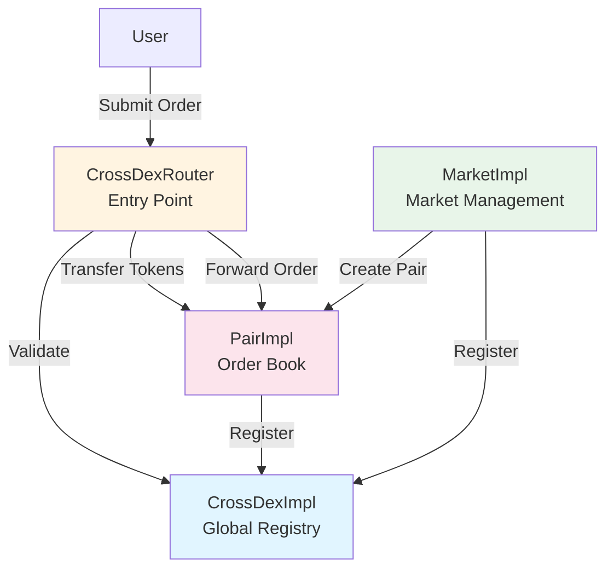
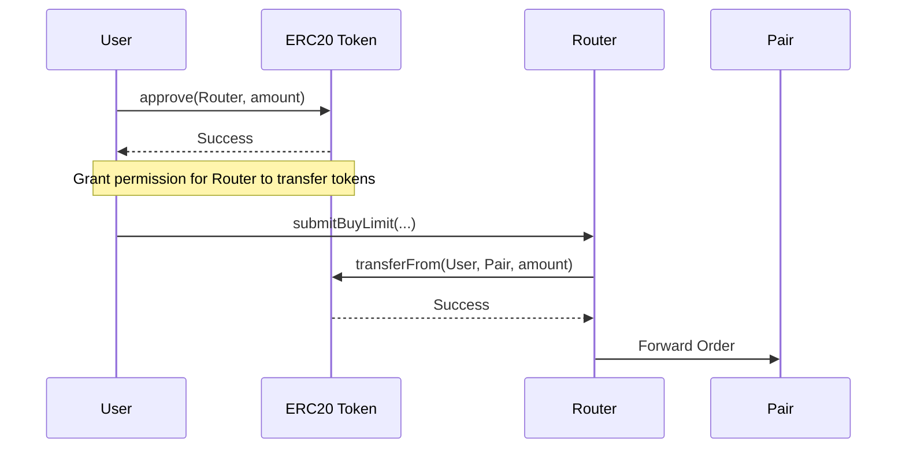
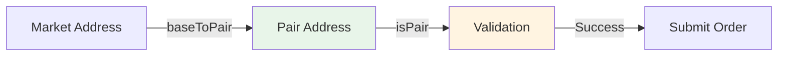
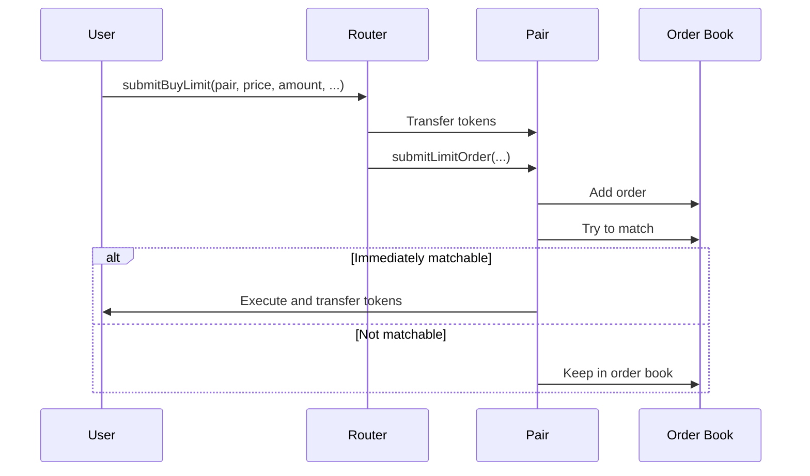
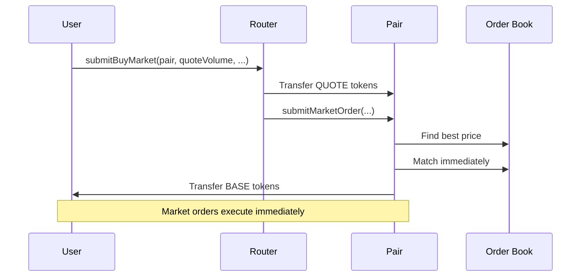

# Router Order Script Guide (English)

A detailed guide on how to place orders using the Router.

## 📋 Table of Contents

1. [Overview and Introduction](#1-overview-and-introduction)
2. [Environment Setup and Contract Addresses](#2-environment-setup-and-contract-addresses)
3. [ERC20 Token Approve](#3-erc20-token-approve)
4. [Getting Pair Address](#4-getting-pair-address)
5. [Limit Orders](#5-limit-orders)
6. [Market Orders](#6-market-orders)
7. [Canceling Orders](#7-canceling-orders)
8. [Using Native CROSS Coin](#8-using-native-cross-coin)
9. [Example Code](#9-example-code)
10. [Advanced Usage](#10-advanced-usage)
11. [Troubleshooting](#11-troubleshooting)

---

## 1. Overview and Introduction

### Role of Router

CrossDex Router is the entry point for placing orders on the DEX. The Router performs the following roles:

- **Order Routing**: Routes user orders to the appropriate Pair contract
- **Token Transfer Handling**: Safely transfers user tokens to Pair contracts
- **Native CROSS Handling**: Automatically wraps/unwraps native CROSS coin
- **Validation**: Validates Pair addresses and restricts contract accounts (V2)

### Order Types Overview

The Router supports two main order types:

#### 1. Limit Order
- **Feature**: Places order at user-specified price
- **Advantage**: Can execute at desired price
- **Disadvantage**: May not execute immediately if price doesn't match
- **Use Case**: When you want to trade at a specific price

#### 2. Market Order
- **Feature**: Executes immediately at the best available market price
- **Advantage**: Guaranteed fast execution
- **Disadvantage**: Price slippage risk
- **Use Case**: When you want to trade quickly

### System Architecture



---

## 2. Environment Setup and Contract Addresses

### Network RPC URL

```typescript
const RPC_URL = 'https://mainnet.crosstoken.io:22001';
```

### Contract Addresses (Mainnet)

```
CrossDex Proxy: 0x89e23B854e432e5c759D49e643d3e612EadB7a6B
Router Proxy:   0x6690844Aac584AcA982E195B7BDeBd48740fbcb1
WETH (wCROSS):  0x52D3256c7d6C7522C6D593b2aC662dBF610E6813

Markets:
- Game Market: 0xa0f50f79615247530fABcC3efd79B8e5b961b966
- USDTx Market: 0xB7811907b2839d6b5CCF908D6B58dE944D8AfbA7
- Verse8 Market: 0xcb95777d0f8d2EfA5e836Cb65f814dF8C7261d83
```

### TypeScript Setup (ethers.js)

#### Package Installation

```bash
npm install ethers
```

or

```bash
yarn add ethers
```

#### Basic Setup

```typescript
import { ethers } from 'ethers';

const provider = new ethers.JsonRpcProvider(RPC_URL);
```

### Creating Wallet with Private Key

#### Method 1: From Environment Variable (Recommended)

```typescript
// .env file
PRIVATE_KEY=your_private_key_here

// TypeScript code
const privateKey = process.env.PRIVATE_KEY;
if (!privateKey) {
    throw new Error('PRIVATE_KEY environment variable is not set');
}
const wallet = new ethers.Wallet(privateKey, provider);
```

#### Method 2: From File

```typescript
import * as fs from 'fs';

const privateKey = fs.readFileSync('.private-key', 'utf-8').trim();
const wallet = new ethers.Wallet(privateKey, provider);
```

#### Method 3: Direct Input (Dev Only)

```typescript
// ⚠️ Warning: Never use in production!
const privateKey = 'your_private_key_here';
const wallet = new ethers.Wallet(privateKey, provider);
```

#### Security Notes

- ✅ Use environment variables (recommended)
- ✅ Add `.env` file to `.gitignore`
- ❌ Never hardcode private keys in code
- ❌ Never commit private keys to public repositories

---

## 3. ERC20 Token Approve

### Why Approve is Needed

For Router to transfer user tokens to Pair contract, the user must first grant token transfer permission to Router. This is the ERC20 `approve` function.

### Approve Flow



### Approve Target

Approve to **Router contract address**. Router internally transfers tokens to Pair.

```typescript
const ROUTER = '0x6690844Aac584AcA982E195B7BDeBd48740fbcb1';
```

### Approve Methods

#### Approve Specific Amount

```typescript
const tokenContract = new ethers.Contract(tokenAddress, IERC20ABI, wallet);
const amount = ethers.parseEther('1000'); // 1000 tokens
await tokenContract.approve(ROUTER, amount);
```

#### Unlimited Approve (Recommended)

```typescript
const tokenContract = new ethers.Contract(tokenAddress, IERC20ABI, wallet);
await tokenContract.approve(ROUTER, ethers.MaxUint256);
```

**Advantages**:
- Gas efficient (only need to approve once)
- No need for repeated approve transactions

**Note**:
- If Router is compromised, unlimited tokens can be transferred
- Router is a trusted contract, so generally safe

### Check Approve

```typescript
const currentAllowance = await tokenContract.allowance(wallet.address, ROUTER);
console.log('Current allowance:', ethers.formatEther(currentAllowance));
```

### Required Approve by Order Type

| Order Type | Token to Approve | Approve Target |
|-----------|-----------------|----------------|
| Buy Limit | QUOTE token | Router |
| Sell Limit | BASE token | Router |
| Buy Market | QUOTE token | Router |
| Sell Market | BASE token | Router |
| Native CROSS | None | Direct transfer |

### Native CROSS Coin

Native CROSS coin is not ERC20, so no approve is needed. Send directly by setting `value` in the transaction.

---

## 4. Getting Pair Address

### What is Pair?

Pair is a contract that manages the order book for a specific BASE/QUOTE token pair. For example:
- BASE: Game Token
- QUOTE: CROSS
- Pair: Game Token/CROSS trading pair

### Getting Pair from Market

#### Method 1: Using `baseToPair()` (Recommended)

```typescript
const marketContract = new ethers.Contract(marketAddress, IMarketABI, provider);
const pair = await marketContract.baseToPair(baseToken);
```

**Example**:
```typescript
const marketAddress = '0xa0f50f79615247530fABcC3efd79B8e5b961b966'; // Game Market
const baseToken = '0x...'; // Game Token address
const pair = await marketContract.baseToPair(baseToken);
console.log('Pair address:', pair);
```

#### Method 2: Using `allPairs()`

```typescript
const [bases, pairs] = await marketContract.allPairs();
// Find in bases and pairs arrays
const index = bases.indexOf(baseToken);
const pair = pairs[index];
```

### Pair Validation

It's recommended to verify Pair address is valid before placing orders:

```typescript
const routerContract = new ethers.Contract(ROUTER, IRouterABI, wallet);
const isValidPair = await routerContract.isPair(pair);
if (!isValidPair) {
    throw new Error('Invalid pair address');
}
```

### Query Flow



---

## 5. Limit Orders

### Buy Limit Order (`submitBuyLimit`)

Places an order to buy BASE tokens at or below the specified price.

#### Parameter Description

| Parameter | Type | Description |
|----------|------|-------------|
| `pair` | address | Pair contract address |
| `price` | uint256 | Limit price (must be divisible by tickSize) |
| `amount` | uint256 | Order amount (must be divisible by lotSize) |
| `constraints` | uint8 | Order constraints (0: GTC, 1: IOC, 2: FOK) |
| `adjacent` | uint256[2] | Previous price search range (typically [0, 0]) |
| `maxMatchCount` | uint256 | Maximum match count (0 for Router default) |

#### Order Constraints

```typescript
const GOOD_TILL_CANCEL = 0;        // Keep until canceled
const IMMEDIATE_OR_CANCEL = 1;     // Execute immediately or cancel
const FILL_OR_KILL = 2;            // Fill completely or cancel
```

**GOOD_TILL_CANCEL (GTC)**:
- Most common option
- Order remains in order book until executed or canceled

**IMMEDIATE_OR_CANCEL (IOC)**:
- Only immediately executable portion is executed
- Unfilled portion is automatically canceled

**FILL_OR_KILL (FOK)**:
- Fill completely or cancel entirely
- No partial fills allowed

#### Required Token Amount Calculation

For buy orders, QUOTE token including fees is required:

```typescript
const routerContract = new ethers.Contract(ROUTER, IRouterABI, wallet);
const quoteVolume = (price * amount) / BigInt(10 ** 18);
const requiredQuote = await routerContract.getRequiredBuyVolume(pair, quoteVolume);
console.log('Required QUOTE (including fee):', ethers.formatEther(requiredQuote));
```

#### Example Code

```typescript
async function submitBuyLimitOrder(
    wallet: ethers.Wallet,
    pair: string,
    price: bigint,
    amount: bigint,
    constraints: number = GOOD_TILL_CANCEL,
    maxMatchCount: bigint = BigInt(0)
): Promise<bigint> {
    const routerContract = new ethers.Contract(ROUTER, IRouterABI, wallet);
    
    // Validate pair
    const isValidPair = await routerContract.isPair(pair);
    if (!isValidPair) {
        throw new Error('Invalid pair address');
    }
    
    // Calculate required QUOTE amount including fee
    const quoteVolume = (price * amount) / BigInt(10 ** 18);
    const requiredQuote = await routerContract.getRequiredBuyVolume(pair, quoteVolume);
    console.log('Required QUOTE (including fee):', ethers.formatEther(requiredQuote));
    
    // adjacent parameter (previous price search range)
    const adjacent: [bigint, bigint] = [BigInt(0), BigInt(0)];
    
    // Send transaction
    const tx = await routerContract.submitBuyLimit(
        pair,
        price,
        amount,
        constraints,
        adjacent,
        maxMatchCount,
        { value: 0 } // value is 0 when using ERC20 tokens
    );
    
    const receipt = await tx.wait();
    console.log('Transaction confirmed in block:', receipt.blockNumber);
    
    // Order ID should be extracted from events (shown as example only)
    return BigInt(receipt.logs.length > 0 ? receipt.logs[0].topics[1] : 0);
}
```

### Sell Limit Order (`submitSellLimit`)

Places an order to sell BASE tokens at or above the specified price.

#### Parameter Description

Same as buy order, but BASE token must be approved.

#### Example Code

```typescript
async function submitSellLimitOrder(
    wallet: ethers.Wallet,
    pair: string,
    price: bigint,
    amount: bigint,
    constraints: number = GOOD_TILL_CANCEL,
    maxMatchCount: bigint = BigInt(0)
): Promise<bigint> {
    const routerContract = new ethers.Contract(ROUTER, IRouterABI, wallet);
    
    const isValidPair = await routerContract.isPair(pair);
    if (!isValidPair) {
        throw new Error('Invalid pair address');
    }
    
    const adjacent: [bigint, bigint] = [BigInt(0), BigInt(0)];
    
    const tx = await routerContract.submitSellLimit(
        pair,
        price,
        amount,
        constraints,
        adjacent,
        maxMatchCount,
        { value: 0 }
    );
    
    const receipt = await tx.wait();
    console.log('Transaction confirmed in block:', receipt.blockNumber);
    
    return BigInt(receipt.logs.length > 0 ? receipt.logs[0].topics[1] : 0);
}
```

### Order Processing Flow



---

## 6. Market Orders

### Buy Market Order (`submitBuyMarket`)

Immediately buys BASE tokens at the best available market price.

#### Parameter Description

| Parameter | Type | Description |
|----------|------|-------------|
| `pair` | address | Pair contract address |
| `quoteVolume` | uint256 | QUOTE token amount to spend |
| `maxMatchCount` | uint256 | Maximum match count (0 for Router default) |

#### Fee-Inclusive Calculation

```typescript
const requiredQuote = await routerContract.getRequiredBuyVolume(pair, quoteVolume);
console.log('Required QUOTE (including fee):', ethers.formatEther(requiredQuote));
```

#### Example Code

```typescript
async function submitBuyMarketOrder(
    wallet: ethers.Wallet,
    pair: string,
    quoteVolume: bigint,
    maxMatchCount: bigint = BigInt(0)
): Promise<void> {
    const routerContract = new ethers.Contract(ROUTER, IRouterABI, wallet);
    
    const isValidPair = await routerContract.isPair(pair);
    if (!isValidPair) {
        throw new Error('Invalid pair address');
    }
    
    // Calculate required QUOTE amount including fee
    const requiredQuote = await routerContract.getRequiredBuyVolume(pair, quoteVolume);
    console.log('Required QUOTE (including fee):', ethers.formatEther(requiredQuote));
    
    const tx = await routerContract.submitBuyMarket(
        pair,
        quoteVolume,
        maxMatchCount,
        { value: 0 }
    );
    
    const receipt = await tx.wait();
    console.log('Transaction confirmed in block:', receipt.blockNumber);
}
```

### Sell Market Order (`submitSellMarket`)

Immediately sells BASE tokens at the best available market price.

#### Parameter Description

| Parameter | Type | Description |
|----------|------|-------------|
| `pair` | address | Pair contract address |
| `amount` | uint256 | BASE token amount to sell |
| `maxMatchCount` | uint256 | Maximum match count |

#### Example Code

```typescript
async function submitSellMarketOrder(
    wallet: ethers.Wallet,
    pair: string,
    amount: bigint,
    maxMatchCount: bigint = BigInt(0)
): Promise<void> {
    const routerContract = new ethers.Contract(ROUTER, IRouterABI, wallet);
    
    const isValidPair = await routerContract.isPair(pair);
    if (!isValidPair) {
        throw new Error('Invalid pair address');
    }
    
    const tx = await routerContract.submitSellMarket(
        pair,
        amount,
        maxMatchCount,
        { value: 0 }
    );
    
    const receipt = await tx.wait();
    console.log('Transaction confirmed in block:', receipt.blockNumber);
}
```

### Market Order Processing Flow



---

## 7. Canceling Orders

### How to Cancel Orders

You can cancel unfilled limit orders.

#### Parameter Description

| Parameter | Type | Description |
|----------|------|-------------|
| `pair` | address | Pair contract address |
| `orderIds` | uint256[] | Array of order IDs to cancel |

#### Cancel Limit (`cancelLimit`)

There is a limit on the number of orders that can be canceled at once. Cannot exceed Router's `cancelLimit` setting.

#### Example Code

```typescript
async function cancelOrders(
    wallet: ethers.Wallet,
    pair: string,
    orderIds: bigint[]
): Promise<void> {
    const routerContract = new ethers.Contract(ROUTER, IRouterABI, wallet);
    
    const isValidPair = await routerContract.isPair(pair);
    if (!isValidPair) {
        throw new Error('Invalid pair address');
    }
    
    if (orderIds.length === 0) {
        throw new Error('No order IDs provided');
    }
    
    const tx = await routerContract.cancelOrder(pair, orderIds);
    const receipt = await tx.wait();
    console.log('Orders cancelled');
    console.log('Transaction confirmed in block:', receipt.blockNumber);
}
```

---

## 8. Using Native CROSS Coin

### Sending Native CROSS

Native CROSS coin is not ERC20, so no approve is needed. Instead, send directly by setting `value` in the transaction.

### Example Code

```typescript
async function submitBuyLimitWithNativeCROSS(
    wallet: ethers.Wallet,
    pair: string,
    price: bigint,
    amount: bigint,
    maxMatchCount: bigint = BigInt(0)
): Promise<bigint> {
    const routerContract = new ethers.Contract(ROUTER, IRouterABI, wallet);
    
    const isValidPair = await routerContract.isPair(pair);
    if (!isValidPair) {
        throw new Error('Invalid pair address');
    }
    
    // Calculate required QUOTE amount including fee
    const quoteVolume = (price * amount) / BigInt(10 ** 18);
    const requiredQuote = await routerContract.getRequiredBuyVolume(pair, quoteVolume);
    
    // Check wallet CROSS balance
    const balance = await wallet.provider.getBalance(wallet.address);
    if (balance < requiredQuote) {
        throw new Error(`Insufficient CROSS balance`);
    }
    
    const adjacent: [bigint, bigint] = [BigInt(0), BigInt(0)];
    
    // Set CROSS amount in value
    const tx = await routerContract.submitBuyLimit(
        pair,
        price,
        amount,
        GOOD_TILL_CANCEL,
        adjacent,
        maxMatchCount,
        { value: requiredQuote } // Send native CROSS coin
    );
    
    const receipt = await tx.wait();
    console.log('Transaction confirmed in block:', receipt.blockNumber);
    
    return BigInt(receipt.logs.length > 0 ? receipt.logs[0].topics[1] : 0);
}
```

### Automatic Wrapping/Unwrapping

Router automatically handles native CROSS coin internally:
- **On Send**: Native CROSS → WETH (wCROSS) automatic wrapping
- **On Receive**: WETH (wCROSS) → Native CROSS automatic unwrapping

Users don't need to worry about this process.

---

## 9. Example Code

### TypeScript Example (ethers.js)

Complete example code can be found in:
- [router-order-typescript-ko.ts](./examples/router-order-typescript-ko.ts) - Korean version
- [router-order-typescript-en.ts](./examples/router-order-typescript-en.ts) - English version

### Foundry Script Example

Complete example code can be found in:
- [router-order-script-ko.s.sol](./examples/router-order-script-ko.s.sol) - Korean version
- [router-order-script-en.s.sol](./examples/router-order-script-en.s.sol) - English version

### Complete Example: Approve Token and Submit Buy Limit Order

```typescript
async function exampleBuyLimitOrder() {
    try {
        // 1. Create wallet
        const { provider, wallet } = createWallet();
        
        // 2. Set parameters
        const marketAddress = GAME_MARKET;
        const baseToken = '0x...'; // BASE token address
        const quoteToken = '0x...'; // QUOTE token address
        const price = ethers.parseEther('100'); // Price (e.g., 100 CROSS)
        const amount = ethers.parseEther('1'); // Amount (e.g., 1 BASE token)
        
        // 3. Get Pair address
        const pair = await getPair(provider, marketAddress, baseToken);
        
        // 4. Approve QUOTE token (unlimited)
        await approveToken(wallet, quoteToken, BigInt(0));
        
        // 5. Submit buy limit order
        const orderId = await submitBuyLimitOrder(
            wallet,
            pair,
            price,
            amount,
            GOOD_TILL_CANCEL,
            BigInt(0)
        );
        
        console.log('✅ Buy limit order submitted successfully!');
        console.log('Order ID:', orderId.toString());
        
    } catch (error) {
        console.error('❌ Error:', error);
        throw error;
    }
}
```

---

## 10. Advanced Usage

### Batch Transactions

To process multiple orders at once, you can use Multicall (additional implementation needed).

### Gas Optimization Tips

1. **Use Unlimited Approve**: Avoids repeated approve transactions
2. **Set Appropriate maxMatchCount**: Too high can consume more gas
3. **Cancel Orders in Batch**: More efficient to cancel multiple orders at once

### Order Monitoring

You can monitor order status by listening to events:
- `OrderCreated`: Order created
- `OrderMatched`: Order matched
- `OrderClosed`: Order completed/canceled

---

## 11. Troubleshooting

### Common Errors and Solutions

#### "Invalid pair address"
- **Cause**: Pair address is invalid
- **Solution**: Query correct Pair address using `baseToPair()`

#### "Insufficient allowance"
- **Cause**: Insufficient token approval to Router
- **Solution**: Use `approve()` function to approve tokens

#### "Insufficient balance"
- **Cause**: Insufficient tokens in wallet
- **Solution**: Check wallet balance and top up required tokens

#### "PairInvalidPrice" or "PairInvalidAmount"
- **Cause**: Price or amount is not divisible by tickSize or lotSize
- **Solution**: Check Pair's tickSize and lotSize and adjust to correct values

### Orders Not Filling

1. **Check Price**: For limit orders, compare with current market price
2. **Check Liquidity**: Check if there are matchable orders in the order book
3. **Check Order Constraints**: IOC or FOK constraints may not be met

### Gas Issues

- Set higher gas limit
- Check network congestion
- Adjust gas price

---

## 📚 References

- [Router Contract Documentation](../src/CrossDexRouterV2.sol/contract.CrossDexRouterV2.md)
- [Pair Contract Documentation](../src/PairImplV2.sol/contract.PairImplV2.md)
- [Market Contract Documentation](../src/MarketImplV2.sol/contract.MarketImplV2.md)

