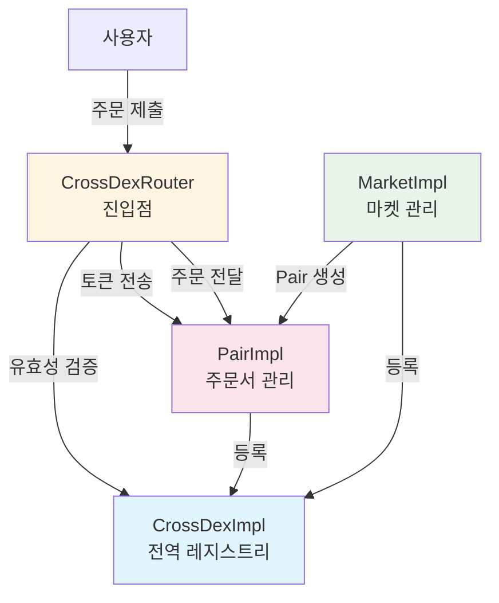
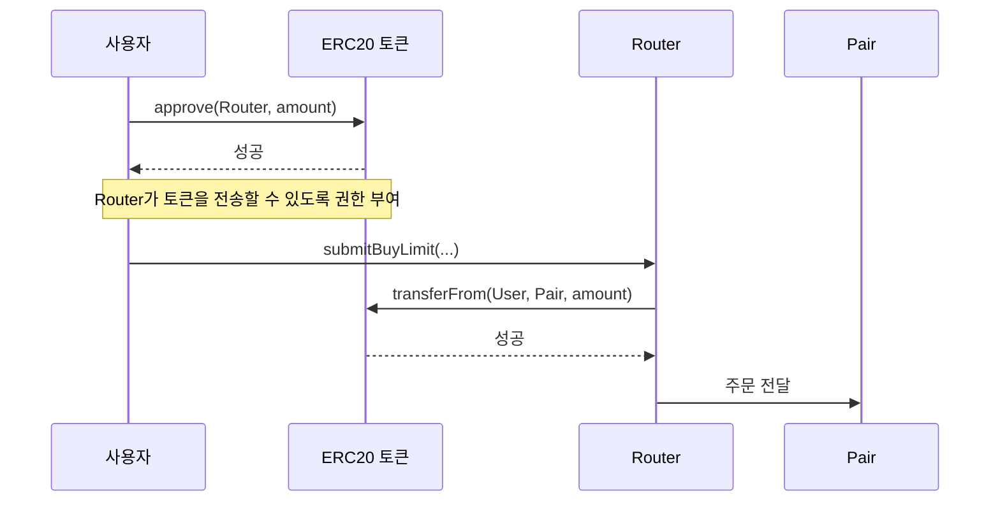
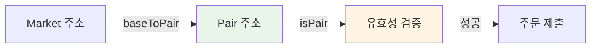
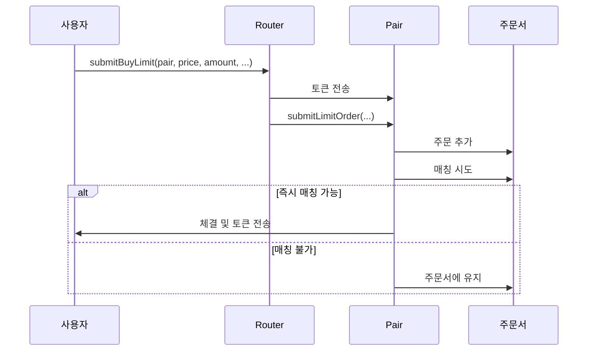
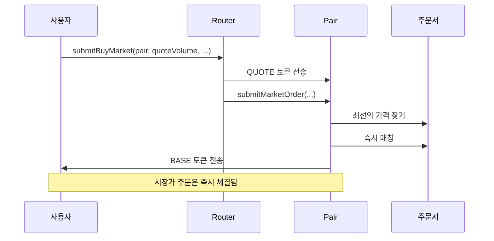

# Router 주문 스크립트 가이드 (한국어)

Router를 사용하여 주문을 넣는 방법에 대한 상세 가이드입니다.

## 📋 목차

1. [개요 및 소개](#1-개요-및-소개)
2. [환경 설정 및 컨트랙트 주소](#2-환경-설정-및-컨트랙트-주소)
3. [ERC20 토큰 Approve](#3-erc20-토큰-approve)
4. [Pair 주소 조회 방법](#4-pair-주소-조회-방법)
5. [지정가 주문 (Limit Order)](#5-지정가-주문-limit-order)
6. [시장가 주문 (Market Order)](#6-시장가-주문-market-order)
7. [주문 취소](#7-주문-취소)
8. [CROSS 네이티브 코인 사용](#8-cross-네이티브-코인-사용)
9. [예제 코드](#9-예제-코드)
10. [고급 사용법](#10-고급-사용법)
11. [트러블슈팅](#11-트러블슈팅)

---

## 1. 개요 및 소개

### Router의 역할

CrossDex Router는 DEX에서 주문을 넣기 위한 진입점(Entry Point)입니다. Router는 다음과 같은 역할을 합니다:

- **주문 라우팅**: 사용자의 주문을 적절한 Pair 컨트랙트로 전달
- **토큰 전송 처리**: 사용자의 토큰을 Pair 컨트랙트로 안전하게 전송
- **네이티브 CROSS 처리**: 네이티브 CROSS 코인을 자동으로 래핑/언래핑
- **유효성 검증**: Pair 주소 유효성 검증 및 계약 계정 제한 (V2)

### 주문 유형 개요

Router는 두 가지 주요 주문 유형을 지원합니다:

#### 1. 지정가 주문 (Limit Order)
- **특징**: 사용자가 지정한 가격으로 주문
- **장점**: 원하는 가격에 체결 가능
- **단점**: 가격이 맞지 않으면 즉시 체결되지 않을 수 있음
- **사용 시나리오**: 특정 가격에 거래하고 싶을 때

#### 2. 시장가 주문 (Market Order)
- **특징**: 현재 시장에서 사용 가능한 최선의 가격으로 즉시 체결
- **장점**: 빠른 체결 보장
- **단점**: 가격 변동 위험
- **사용 시나리오**: 빠르게 거래하고 싶을 때

### 시스템 아키텍처



---

## 2. 환경 설정 및 컨트랙트 주소

### 네트워크 RPC URL

```typescript
const RPC_URL = 'https://mainnet.crosstoken.io:22001';
```

### 주요 컨트랙트 주소 (Mainnet)

```
CrossDex Proxy: 0x89e23B854e432e5c759D49e643d3e612EadB7a6B
Router Proxy:   0x6690844Aac584AcA982E195B7BDeBd48740fbcb1
WETH (wCROSS):  0x52D3256c7d6C7522C6D593b2aC662dBF610E6813

Markets:
- Game Market: 0xa0f50f79615247530fABcC3efd79B8e5b961b966
- USDTx Market: 0xB7811907b2839d6b5CCF908D6B58dE944D8AfbA7
- Verse8 Market: 0xcb95777d0f8d2EfA5e836Cb65f814dF8C7261d83
```

---

## 3. ERC20 토큰 Approve

### Approve가 필요한 이유

Router가 사용자의 토큰을 Pair 컨트랙트로 전송하려면, 사용자가 먼저 Router에 토큰 전송 권한을 부여해야 합니다. 이것이 ERC20의 `approve` 함수입니다.

### Approve 흐름



### Approve 대상

**Router 컨트랙트 주소**에 Approve해야 합니다. Router가 내부적으로 Pair로 토큰을 전송합니다.

```typescript
const ROUTER = '0x6690844Aac584AcA982E195B7BDeBd48740fbcb1';
```

### Approve 방법

#### 특정 양만 Approve

```typescript
const tokenContract = new ethers.Contract(tokenAddress, IERC20ABI, wallet);
const amount = ethers.parseEther('1000'); // 1000 토큰
await tokenContract.approve(ROUTER, amount);
```

#### 무제한 Approve (권장)

```typescript
const tokenContract = new ethers.Contract(tokenAddress, IERC20ABI, wallet);
await tokenContract.approve(ROUTER, ethers.MaxUint256);
```

**장점**: 
- 가스 효율적 (한 번만 Approve하면 계속 사용 가능)
- 반복적인 Approve 트랜잭션 불필요

**주의사항**:
- Router가 해킹당하면 무제한으로 토큰을 전송할 수 있습니다
- Router는 신뢰할 수 있는 컨트랙트이므로 일반적으로 안전합니다

### Approve 확인

```typescript
const currentAllowance = await tokenContract.allowance(wallet.address, ROUTER);
console.log('Current allowance:', ethers.formatEther(currentAllowance));
```

### 주문별 필요한 Approve

| 주문 유형 | Approve 필요 토큰 | Approve 대상 |
|---------|-----------------|-------------|
| 매수 지정가 | QUOTE 토큰 | Router |
| 매도 지정가 | BASE 토큰 | Router |
| 매수 시장가 | QUOTE 토큰 | Router |
| 매도 시장가 | BASE 토큰 | Router |
| CROSS 네이티브 코인 | 없음 | 직접 전송 |

### CROSS 네이티브 코인

CROSS 네이티브 코인은 ERC20이 아니므로 Approve가 필요 없습니다. 트랜잭션에 `value`를 설정하여 직접 전송합니다.

---

## 4. Pair 주소 조회 방법

### Pair란?

Pair는 특정 BASE/QUOTE 토큰 쌍에 대한 주문서를 관리하는 컨트랙트입니다. 예를 들어:
- BASE: Game Token
- QUOTE: CROSS
- Pair: Game Token/CROSS 거래 쌍

### Market에서 Pair 조회

#### 방법 1: `baseToPair()` 사용 (권장)

```typescript
const marketContract = new ethers.Contract(marketAddress, IMarketABI, provider);
const pair = await marketContract.baseToPair(baseToken);
```

**예제**:
```typescript
const marketAddress = '0xa0f50f79615247530fABcC3efd79B8e5b961b966'; // Game Market
const baseToken = '0x...'; // Game Token 주소
const pair = await marketContract.baseToPair(baseToken);
console.log('Pair address:', pair);
```

#### 방법 2: `allPairs()` 사용

```typescript
const [bases, pairs] = await marketContract.allPairs();
// bases와 pairs 배열에서 찾기
const index = bases.indexOf(baseToken);
const pair = pairs[index];
```

### Pair 유효성 검증

주문을 넣기 전에 Pair 주소가 유효한지 확인하는 것이 좋습니다:

```typescript
const routerContract = new ethers.Contract(ROUTER, IRouterABI, wallet);
const isValidPair = await routerContract.isPair(pair);
if (!isValidPair) {
    throw new Error('Invalid pair address');
}
```

### 조회 흐름



---

## 5. 지정가 주문 (Limit Order)

### 매수 지정가 주문 (`submitBuyLimit`)

지정한 가격 이하로 BASE 토큰을 구매하는 주문입니다.

#### 파라미터 설명

| 파라미터 | 타입 | 설명 |
|---------|------|------|
| `pair` | address | Pair 컨트랙트 주소 |
| `price` | uint256 | 지정 가격 (tickSize로 나누어 떨어져야 함) |
| `amount` | uint256 | 주문 수량 (lotSize로 나누어 떨어져야 함) |
| `constraints` | uint8 | 주문 제약 조건 (0: GTC, 1: IOC, 2: FOK) |
| `adjacent` | uint256[2] | 이전 가격 검색 범위 (일반적으로 [0, 0]) |
| `maxMatchCount` | uint256 | 최대 매칭 횟수 (0이면 Router 기본값 사용) |

#### 주문 제약 조건 (Constraints)

```typescript
const GOOD_TILL_CANCEL = 0;        // 취소할 때까지 유지
const IMMEDIATE_OR_CANCEL = 1;     // 즉시 체결 또는 취소
const FILL_OR_KILL = 2;            // 전량 체결 또는 취소
```

**GOOD_TILL_CANCEL (GTC)**: 
- 가장 일반적인 옵션
- 주문이 체결되거나 취소될 때까지 주문서에 유지

**IMMEDIATE_OR_CANCEL (IOC)**:
- 즉시 체결 가능한 부분만 체결
- 체결되지 않은 부분은 자동 취소

**FILL_OR_KILL (FOK)**:
- 전량 체결되거나 전체 취소
- 부분 체결 불가

#### 필요 토큰 양 계산

매수 주문의 경우, 수수료를 포함한 QUOTE 토큰이 필요합니다:

```typescript
const routerContract = new ethers.Contract(ROUTER, IRouterABI, wallet);
const quoteVolume = (price * amount) / BigInt(10 ** 18);
const requiredQuote = await routerContract.getRequiredBuyVolume(pair, quoteVolume);
console.log('Required QUOTE (including fee):', ethers.formatEther(requiredQuote));
```

#### 예제 코드

```typescript
async function submitBuyLimitOrder(
    wallet: ethers.Wallet,
    pair: string,
    price: bigint,
    amount: bigint,
    constraints: number = GOOD_TILL_CANCEL,
    maxMatchCount: bigint = BigInt(0)
): Promise<bigint> {
    const routerContract = new ethers.Contract(ROUTER, IRouterABI, wallet);
    
    // Pair 유효성 검증
    const isValidPair = await routerContract.isPair(pair);
    if (!isValidPair) {
        throw new Error('Invalid pair address');
    }
    
    // 필요한 수수료 포함 QUOTE 양 계산
    const quoteVolume = (price * amount) / BigInt(10 ** 18);
    const requiredQuote = await routerContract.getRequiredBuyVolume(pair, quoteVolume);
    console.log('Required QUOTE (including fee):', ethers.formatEther(requiredQuote));
    
    // adjacent 파라미터 (이전 가격 검색 범위)
    const adjacent: [bigint, bigint] = [BigInt(0), BigInt(0)];
    
    // 트랜잭션 전송
    const tx = await routerContract.submitBuyLimit(
        pair,
        price,
        amount,
        constraints,
        adjacent,
        maxMatchCount,
        { value: 0 } // ERC20 토큰 사용 시 value는 0
    );
    
    const receipt = await tx.wait();
    console.log('Transaction confirmed in block:', receipt.blockNumber);
    
    // Order ID는 이벤트에서 추출해야 함 (예제에서는 간단히 표시)
    return BigInt(receipt.logs.length > 0 ? receipt.logs[0].topics[1] : 0);
}
```

### 매도 지정가 주문 (`submitSellLimit`)

지정한 가격 이상으로 BASE 토큰을 판매하는 주문입니다.

#### 파라미터 설명

매수 주문과 동일하지만, BASE 토큰을 Approve해야 합니다.

#### 예제 코드

```typescript
async function submitSellLimitOrder(
    wallet: ethers.Wallet,
    pair: string,
    price: bigint,
    amount: bigint,
    constraints: number = GOOD_TILL_CANCEL,
    maxMatchCount: bigint = BigInt(0)
): Promise<bigint> {
    const routerContract = new ethers.Contract(ROUTER, IRouterABI, wallet);
    
    const isValidPair = await routerContract.isPair(pair);
    if (!isValidPair) {
        throw new Error('Invalid pair address');
    }
    
    const adjacent: [bigint, bigint] = [BigInt(0), BigInt(0)];
    
    const tx = await routerContract.submitSellLimit(
        pair,
        price,
        amount,
        constraints,
        adjacent,
        maxMatchCount,
        { value: 0 }
    );
    
    const receipt = await tx.wait();
    console.log('Transaction confirmed in block:', receipt.blockNumber);
    
    return BigInt(receipt.logs.length > 0 ? receipt.logs[0].topics[1] : 0);
}
```

### 주문 처리 흐름



---

## 6. 시장가 주문 (Market Order)

### 매수 시장가 주문 (`submitBuyMarket`)

현재 시장에서 사용 가능한 최선의 가격으로 즉시 BASE 토큰을 구매합니다.

#### 파라미터 설명

| 파라미터 | 타입 | 설명 |
|---------|------|------|
| `pair` | address | Pair 컨트랙트 주소 |
| `quoteVolume` | uint256 | QUOTE 토큰 사용량 |
| `maxMatchCount` | uint256 | 최대 매칭 횟수 (0이면 Router 기본값 사용) |

#### 수수료 포함 계산

```typescript
const requiredQuote = await routerContract.getRequiredBuyVolume(pair, quoteVolume);
console.log('Required QUOTE (including fee):', ethers.formatEther(requiredQuote));
```

#### 예제 코드

```typescript
async function submitBuyMarketOrder(
    wallet: ethers.Wallet,
    pair: string,
    quoteVolume: bigint,
    maxMatchCount: bigint = BigInt(0)
): Promise<void> {
    const routerContract = new ethers.Contract(ROUTER, IRouterABI, wallet);
    
    const isValidPair = await routerContract.isPair(pair);
    if (!isValidPair) {
        throw new Error('Invalid pair address');
    }
    
    // 필요한 수수료 포함 QUOTE 양 계산
    const requiredQuote = await routerContract.getRequiredBuyVolume(pair, quoteVolume);
    console.log('Required QUOTE (including fee):', ethers.formatEther(requiredQuote));
    
    const tx = await routerContract.submitBuyMarket(
        pair,
        quoteVolume,
        maxMatchCount,
        { value: 0 }
    );
    
    const receipt = await tx.wait();
    console.log('Transaction confirmed in block:', receipt.blockNumber);
}
```

### 매도 시장가 주문 (`submitSellMarket`)

현재 시장에서 사용 가능한 최선의 가격으로 즉시 BASE 토큰을 판매합니다.

#### 파라미터 설명

| 파라미터 | 타입 | 설명 |
|---------|------|------|
| `pair` | address | Pair 컨트랙트 주소 |
| `amount` | uint256 | BASE 토큰 판매량 |
| `maxMatchCount` | uint256 | 최대 매칭 횟수 |

#### 예제 코드

```typescript
async function submitSellMarketOrder(
    wallet: ethers.Wallet,
    pair: string,
    amount: bigint,
    maxMatchCount: bigint = BigInt(0)
): Promise<void> {
    const routerContract = new ethers.Contract(ROUTER, IRouterABI, wallet);
    
    const isValidPair = await routerContract.isPair(pair);
    if (!isValidPair) {
        throw new Error('Invalid pair address');
    }
    
    const tx = await routerContract.submitSellMarket(
        pair,
        amount,
        maxMatchCount,
        { value: 0 }
    );
    
    const receipt = await tx.wait();
    console.log('Transaction confirmed in block:', receipt.blockNumber);
}
```

### 시장가 주문 처리 흐름



---

## 7. 주문 취소 (`cancelOrder`)

### 주문 취소 방법

체결되지 않은 지정가 주문을 취소할 수 있습니다.

#### 파라미터 설명

| 파라미터 | 타입 | 설명 |
|---------|------|------|
| `pair` | Pair 컨트랙트 주소 | 주소 |
| `orderIds` | uint256[] | 취소할 주문 ID 배열 |

#### 취소 제한 (`cancelLimit`)

한 번에 취소할 수 있는 주문 수에는 제한이 있습니다. Router의 `cancelLimit` 설정값을 초과할 수 없습니다.

#### 예제 코드

```typescript
async function cancelOrders(
    wallet: ethers.Wallet,
    pair: string,
    orderIds: bigint[]
): Promise<void> {
    const routerContract = new ethers.Contract(ROUTER, IRouterABI, wallet);
    
    const isValidPair = await routerContract.isPair(pair);
    if (!isValidPair) {
        throw new Error('Invalid pair address');
    }
    
    if (orderIds.length === 0) {
        throw new Error('No order IDs provided');
    }
    
    const tx = await routerContract.cancelOrder(pair, orderIds);
    const receipt = await tx.wait();
    console.log('Orders cancelled');
    console.log('Transaction confirmed in block:', receipt.blockNumber);
}
```

---

## 8. CROSS 네이티브 코인 사용

### 네이티브 CROSS 전송

CROSS 네이티브 코인은 ERC20이 아니므로 Approve가 필요 없습니다. 대신 트랜잭션에 `value`를 설정하여 직접 전송합니다.

### 예제 코드

```typescript
async function submitBuyLimitWithNativeCROSS(
    wallet: ethers.Wallet,
    pair: string,
    price: bigint,
    amount: bigint,
    maxMatchCount: bigint = BigInt(0)
): Promise<bigint> {
    const routerContract = new ethers.Contract(ROUTER, IRouterABI, wallet);
    
    const isValidPair = await routerContract.isPair(pair);
    if (!isValidPair) {
        throw new Error('Invalid pair address');
    }
    
    // 필요한 수수료 포함 QUOTE 양 계산
    const quoteVolume = (price * amount) / BigInt(10 ** 18);
    const requiredQuote = await routerContract.getRequiredBuyVolume(pair, quoteVolume);
    
    // Wallet의 CROSS 잔액 확인
    const balance = await wallet.provider.getBalance(wallet.address);
    if (balance < requiredQuote) {
        throw new Error(`Insufficient CROSS balance`);
    }
    
    const adjacent: [bigint, bigint] = [BigInt(0), BigInt(0)];
    
    // value에 CROSS 양 설정
    const tx = await routerContract.submitBuyLimit(
        pair,
        price,
        amount,
        GOOD_TILL_CANCEL,
        adjacent,
        maxMatchCount,
        { value: requiredQuote } // CROSS 네이티브 코인 전송
    );
    
    const receipt = await tx.wait();
    console.log('Transaction confirmed in block:', receipt.blockNumber);
    
    return BigInt(receipt.logs.length > 0 ? receipt.logs[0].topics[1] : 0);
}
```

### 자동 래핑/언래핑

Router는 내부적으로 CROSS 네이티브 코인을 자동으로 처리합니다:
- **전송 시**: 네이티브 CROSS → WETH (wCROSS) 자동 래핑
- **수신 시**: WETH (wCROSS) → 네이티브 CROSS 자동 언래핑

사용자는 이 과정을 신경 쓰지 않아도 됩니다.

---

## 9. 예제 코드

### TypeScript 예제 (ethers.js)

완전한 예제 코드는 다음 파일을 참조하세요:
- [router-order-typescript-ko.ts](./examples/router-order-typescript-ko.ts) - 한국어 버전
- [router-order-typescript-en.ts](./examples/router-order-typescript-en.ts) - 영어 버전


### 완전한 예제: 토큰 Approve 후 매수 지정가 주문

```typescript
async function exampleBuyLimitOrder() {
    try {
        // 1. Wallet 생성
        const { provider, wallet } = createWallet();
        
        // 2. 파라미터 설정
        const marketAddress = GAME_MARKET;
        const baseToken = '0x...'; // BASE 토큰 주소
        const quoteToken = '0x...'; // QUOTE 토큰 주소
        const price = ethers.parseEther('100'); // 가격 (예: 100 CROSS)
        const amount = ethers.parseEther('1'); // 수량 (예: 1 BASE 토큰)
        
        // 3. Pair 주소 조회
        const pair = await getPair(provider, marketAddress, baseToken);
        
        // 4. QUOTE 토큰 Approve (무제한)
        await approveToken(wallet, quoteToken, BigInt(0));
        
        // 5. 매수 지정가 주문
        const orderId = await submitBuyLimitOrder(
            wallet,
            pair,
            price,
            amount,
            GOOD_TILL_CANCEL,
            BigInt(0)
        );
        
        console.log('✅ Buy limit order submitted successfully!');
        console.log('Order ID:', orderId.toString());
        
    } catch (error) {
        console.error('❌ Error:', error);
        throw error;
    }
}
```

### TypeScript 설정 (ethers.js)

#### 패키지 설치

```bash
npm install ethers
```

또는

```bash
yarn add ethers
```

#### 기본 설정

```typescript
import { ethers } from 'ethers';

const provider = new ethers.JsonRpcProvider(RPC_URL);
```

### 프라이빗키를 사용한 Wallet 생성

#### 방법 1: 환경 변수에서 가져오기 (권장)

```typescript
// .env 파일
PRIVATE_KEY=your_private_key_here

// TypeScript 코드
const privateKey = process.env.PRIVATE_KEY;
if (!privateKey) {
    throw new Error('PRIVATE_KEY environment variable is not set');
}
const wallet = new ethers.Wallet(privateKey, provider);
```

#### 방법 2: 파일에서 가져오기

```typescript
import * as fs from 'fs';

const privateKey = fs.readFileSync('.private-key', 'utf-8').trim();
const wallet = new ethers.Wallet(privateKey, provider);
```

#### 방법 3: 직접 입력 (개발 환경만)

```typescript
// ⚠️ 주의: 프로덕션에서는 절대 사용하지 마세요!
const privateKey = 'your_private_key_here';
const wallet = new ethers.Wallet(privateKey, provider);
```

#### 보안 주의사항

- ✅ 환경 변수 사용 권장
- ✅ `.env` 파일을 `.gitignore`에 추가
- ❌ 절대 코드에 프라이빗키를 하드코딩하지 마세요
- ❌ 프라이빗키를 공개 저장소에 커밋하지 마세요

---

## 10. 고급 사용법

### 가스 최적화 팁

1. **무제한 Approve 사용**: 반복적인 Approve 트랜잭션을 피할 수 있습니다
2. **적절한 maxMatchCount 설정**: 너무 높으면 가스 소모가 클 수 있습니다

---

## 11. 트러블슈팅

### 일반적인 에러와 해결 방법

#### "Invalid pair address"
- **원인**: Pair 주소가 유효하지 않음
- **해결**: `baseToPair()`로 올바른 Pair 주소를 조회하세요

#### "Insufficient allowance"
- **원인**: Router에 충분한 토큰 Approve가 없음
- **해결**: `approve()` 함수를 사용하여 토큰을 Approve하세요

#### "Insufficient balance"
- **원인**: 지갑에 충분한 토큰이 없음
- **해결**: 지갑 잔액을 확인하고 필요한 토큰을 충전하세요

#### "PairInvalidPrice" 또는 "PairInvalidAmount"
- **원인**: 가격이나 수량이 tickSize 또는 lotSize로 나누어 떨어지지 않음
- **해결**: Pair의 tickSize와 lotSize를 확인하고 올바른 값으로 조정하세요

### 주문이 체결되지 않는 경우

1. **가격 확인**: 지정가 주문의 경우 현재 시장 가격과 비교
2. **유동성 확인**: 주문서에 매칭 가능한 주문이 있는지 확인
3. **주문 제약 조건 확인**: IOC 또는 FOK 제약 조건이 충족되지 않았을 수 있음

### 가스 부족 문제

- 가스 한도를 높게 설정하세요
- 네트워크 혼잡도를 확인하세요
- 가스 가격을 조정하세요

---

