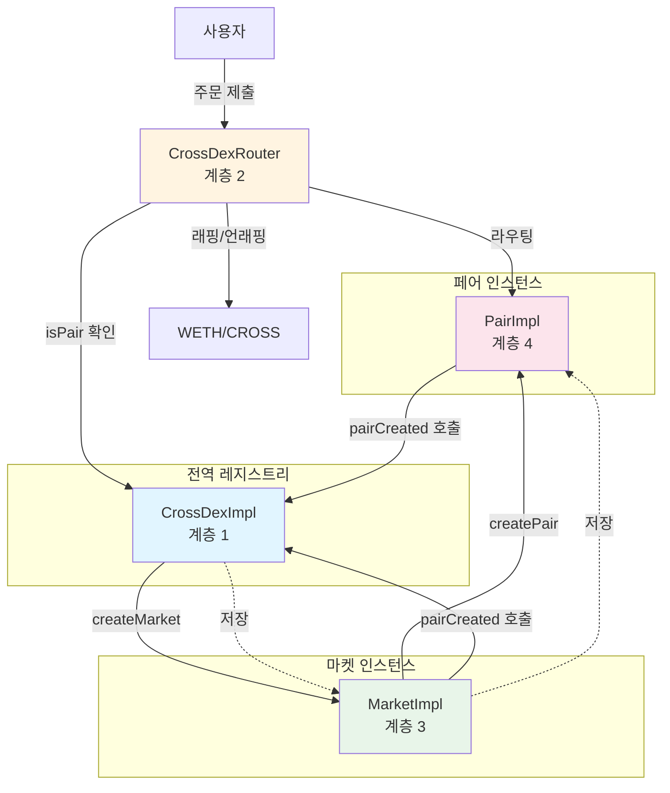
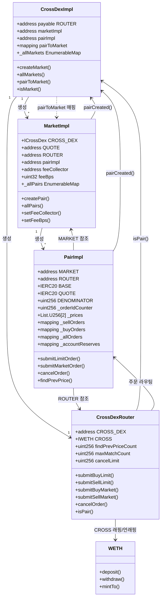
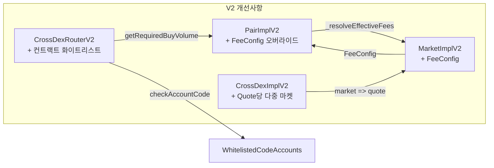

# 기술 문서

이 문서는 DEX 컨트랙트 아키텍처 및 구현에 대한 상세한 기술 정보를 제공합니다.

## 📋 목차

- [아키텍처 개요](#아키텍처-개요)
- [컨트랙트 계층](#컨트랙트-계층)
- [핵심 컨트랙트](#핵심-컨트랙트)
- [데이터 구조](#데이터-구조)
- [핵심 알고리즘](#핵심-알고리즘)
- [V2 변경사항](#v2-변경사항)

## 🏗️ 아키텍처 개요

DEX 시스템은 네 가지 주요 계층으로 구성된 계층적 아키텍처를 따릅니다:

1. **CrossDex 계층**: 글로벌 시스템 관리자
2. **Router 계층**: 주문 라우팅 및 검증
3. **Market 계층**: 마켓 레벨 관리 및 페어 생성
4. **Pair 계층**: 오더북 관리 및 매칭

### 시스템 흐름

```
사용자 → Router → Pair → 오더북 매칭
           ↓
      Market (수수료 구성)
           ↓
      CrossDex (글로벌 레지스트리)
```

### 컨트랙트 관계도



## 📦 컨트랙트 계층

### 컨트랙트 구조 다이어그램



### 계층 1: CrossDexImpl

**목적**: 모든 마켓을 생성하고 추적하는 글로벌 시스템 관리자.

**주요 책임:**
- 마켓 생성 및 등록
- 모든 마켓 주소 추적
- 구현 컨트랙트(Market, Pair) 관리
- 마켓 주소 검증

**주요 스토리지 필드:**
- `ROUTER`: 불변 라우터 주소
- `marketImpl`, `pairImpl`: 구현 컨트랙트 주소
- `_allMarkets`: Quote 토큰에서 마켓으로의 매핑 (V1: quote => market, V2: market => quote)
- `pairToMarket`: 페어에서 마켓으로의 매핑
- `tickSizeSetter`: Tick size 설정 권한이 있는 주소

**주요 함수:**
- `createMarket()`: Quote 토큰에 대한 새 마켓 생성 (1:1 관계)
- `allMarkets()`: 모든 (quote, market) 쌍 반환
- `quoteToMarket()`: 특정 quote 토큰에 대한 마켓 가져오기
- `isMarket()`: 주소가 등록된 마켓인지 확인

**마켓 생성 프로세스:**
1. Quote 토큰이 이미 사용되지 않았는지 검증 (V1)
2. Create2를 사용하여 salt = `keccak256(quote)` (V1) 또는 `keccak256(abi.encode(quote, message))` (V2)로 Market 프록시 배포
3. Quote, feeCollector, feeBps (V1) 또는 feeData (V2)로 마켓 초기화
4. 매핑 저장: `_allMarkets.set(quote, market)` (V1) 또는 `_allMarkets.set(market, quote)` (V2)

### 계층 2: CrossDexRouter

**목적**: 모든 거래 작업의 진입점.

**주요 책임:**
- 페어로 주문 검증 및 라우팅
- 사용자로부터 페어로 토큰 전송
- 네이티브 CROSS 코인 래핑 처리
- 컨트랙트 계정 제한 적용

**주요 스토리지 필드:**
- `CROSS_DEX`: 불변 CrossDex 참조
- `CROSS`: 네이티브 CROSS 코인용 WETH 래퍼
- `findPrevPriceCount`: 지정가 주문 삽입을 위한 최대 검색 가격 레벨 수
- `maxMatchCount`: 주문 실행당 최대 매칭 횟수
- `cancelLimit`: 트랜잭션당 취소 가능한 최대 주문 수
- `whitelistedCodeAccounts` (V2): 라우터와 상호작용할 수 있는 컨트랙트 계정 집합

**주요 함수:**
- `submitBuyLimit()` / `submitSellLimit()`: 지정가 주문 제출
- `submitBuyMarket()` / `submitSellMarket()`: 시장가 주문 제출
- `cancelOrder()`: 대기 중인 주문 취소 (V2는 `nonReentrant` 수정자 추가)
- `isPair()`: 페어 주소 검증
- `getRequiredBuyVolume()` (V2): 구매자 taker 수수료를 포함한 필요 QUOTE 볼륨 계산

**보안 수정자:**
- `checkValue()`: 실행 후 라우터에 남은 네이티브 토큰이 없음을 보장
- `validPair()`: 페어가 CrossDex에 등록되었는지 검증

### 계층 3: MarketImpl

**목적**: 특정 마켓의 거래 페어 및 수수료 구성을 관리.

**주요 스토리지 필드:**
- `CROSS_DEX`: 불변 CrossDex 참조
- `QUOTE`: 불변 quote 토큰 주소
- `ROUTER`: 불변 라우터 주소
- `pairImpl`: Pair 구현 컨트랙트 주소
- `feeCollector`: 수수료가 수집되는 주소
- `feeBps` (V1): 단일 수수료율 (기본 포인트)
- `_feeConfig` (V2): 4개의 개별 수수료율을 포함하는 FeeConfig 구조체
- `_allPairs`: Base 토큰에서 페어로의 매핑
- `deployed`: 마켓이 배포된 블록 번호

**주요 함수:**
- `createPair()`: 새로운 거래 페어(BASE/QUOTE) 생성
  - V1: `createPair(address base, uint256 tickSize, uint256 lotSize)`
  - V2: `createPair(address base, uint256 tickSize, uint256 lotSize, bytes memory feeData)`
- `setFeeCollector()`: 수수료 수집 주소 업데이트
- `setFeeBps()`: 수수료율 업데이트 (V1만)
- `setMarketFees()`: 모든 4개 수수료율 업데이트 (V2만)
- `allPairs()`: 마켓의 모든 페어 나열

**페어 생성 프로세스:**
1. Base 토큰 검증 (제로가 아니고, quote가 아니고, 중복 아님)
2. Create2를 사용하여 salt = `keccak256(abi.encodePacked(base))`로 Pair 프록시 배포
3. ROUTER, QUOTE, BASE, tickSize, lotSize (V1) 또는 추가 feeData (V2)로 페어 초기화
4. 매핑 저장: `_allPairs.set(base, pair)`
5. `pairCreated(pair)`를 통해 CrossDex에 페어 등록

### 계층 4: PairImpl

**목적**: 오더북을 유지하고 매칭을 실행하는 핵심 거래 페어.

**주요 스토리지 필드:**
- `MARKET`: 불변 마켓 주소
- `ROUTER`: 불변 라우터 주소
- `BASE`, `QUOTE`: 불변 토큰 주소
- `DENOMINATOR`: 10^BASE.decimals()
- `baseReserve`, `quoteReserve`: 페어가 추적하는 총 예약량
- `matchedPrice`, `matchedAt`: 최신 매칭 가격 및 타임스탬프
- `tickSize`, `lotSize`: 가격 및 수량 정밀도 요구사항
- `minTradeVolume`: tickSize와 lotSize로부터 계산된 최소 거래량
- `_orderIdCounter`: 고유 주문 ID를 생성하기 위한 카운터
- `_prices`: 두 개의 가격 리스트 (인덱스 0: 매도 오름차순, 인덱스 1: 매수 내림차순)
- `_sellOrders`, `_buyOrders`: 가격에서 주문 ID 리스트로의 매핑
- `_allOrders`: 주문 ID에서 Order 구조체로의 매핑
- `_accountReserves`: 계정에서 [BASE 예약, QUOTE 예약]으로의 매핑
- `feeConfig` (V2): 마켓 기본값을 오버라이드할 수 있는 페어별 수수료 구성

**주문 구조:**
- `side`: OrderSide (SELL 또는 BUY)
- `owner`: 주문 생성자 주소
- `feeBps`: 기본 포인트 단위의 수수료율 (주문 배치 또는 매칭 시 설정)
- `price`: 지정가 (시장가 주문의 경우 0)
- `amount`: Base 토큰 단위의 주문 수량

**주요 함수:**
- `submitLimitOrder()`: 오더북에 주문 추가
- `submitMarketOrder()`: 최상가에서 즉시 실행
- `cancelOrder()`: 오더북에서 주문 제거
- `findPrevPrice()`: 지정가 주문 삽입을 위한 가격 발견

## 📊 데이터 구조

### 오더북 구조

오더북은 효율적인 가격 레벨 관리를 위해 커스텀 `List` 라이브러리를 사용합니다:

- **가격 레벨**: `List.U256`을 사용하여 정렬
  - 매도 주문: 오름차순 가격 정렬 (최저가 먼저)
  - 매수 주문: 내림차순 가격 정렬 (최고가 먼저)
- **동일 가격 주문**: FIFO 순서 (시간순)
- **접근 패턴**: 
  - `_prices[0]`: 매도 가격 (오름차순)
  - `_prices[1]`: 매수 가격 (내림차순)
  - `_sellOrders[price]`: 특정 매도 가격의 주문 ID
  - `_buyOrders[price]`: 특정 매수 가격의 주문 ID

### 계정 예약

사용자는 주문 제출 전에 페어에 토큰을 예치합니다:
- `_accountReserves[account][0]`: BASE 토큰 예약
- `_accountReserves[account][1]`: QUOTE 토큰 예약
- 주문 제출 전에 예약 확인
- 매칭 중에 예약 업데이트

## 🔄 핵심 알고리즘

### 주문 매칭 알고리즘

**매도 주문의 경우:**
1. 최고가부터 매수 주문 검색 시작
2. `buyOrder.price >= sellOrder.price`에서 매칭
3. 매수 주문 가격으로 실행 (판매자가 더 나은 가격 얻음)
4. 주문이 채워지거나 더 이상 매칭이 없을 때까지 계속

**매수 주문의 경우:**
1. 최저가부터 매도 주문 검색 시작
2. `sellOrder.price <= buyOrder.price`에서 매칭
3. 매도 주문 가격으로 실행 (구매자가 더 나은 가격 얻음)
4. 주문이 채워지거나 더 이상 매칭이 없을 때까지 계속

**매칭 프로세스:**
- 거래량은 두 주문의 남은 수량 중 최소값
- 대상 주문이 완전히 채워지면 오더북에서 제거됨
- 그렇지 않으면 대상 주문의 수량이 감소됨
- 새 주문은 거래량이 주문 수량과 같으면 완전히 채워진 것으로 표시되고, 그렇지 않으면 감소됨
- `OrderMatched` 이벤트가 거래 세부 정보와 함께 발생함

### 수수료 수집

**V1:**
- 매수와 매도 주문 모두에 대해 단일 `_exchangeQuote()` 함수 사용
- 수수료는 `amount * feeBps / 10000`로 계산됨
- 수수료와 나머지 값은 매칭 중 즉시 전송됨
- 수수료는 항상 QUOTE 토큰에서 차감됨

**V2:**
- 매도와 매수 주문을 위한 별도의 `_exchangeSellOrder()` 및 `_exchangeBuyOrder()` 함수
- maker/taker 역할 및 주문 측면에 따라 다른 수수료율 적용
- 수수료는 매칭 중에 누적되어 교환 함수에서 반환됨
- 가스 효율성을 위해 매칭 끝에 일괄 전송됨
- 매수 주문의 경우 BASE 토큰을 먼저 전송한 후 QUOTE 금액에 대해 수수료 계산

**수수료 계산:**
- 수수료는 항상 QUOTE 토큰에서 차감됩니다
- 매도 주문의 경우: 받은 QUOTE에서 수수료 차감
- 매수 주문의 경우: 사용한 QUOTE에서 수수료 차감
- V2: 수수료율이 maker/taker 및 buy/sell에 따라 다름
- V2: 수수료는 매칭 중에 누적되어 가스 효율을 위해 끝에 일괄 전송됨

### 가격 발견 (findPrevPrice)

지정가 주문을 올바른 가격 레벨에 삽입하는 데 사용됩니다:

1. 기존 가격 레벨 검색
2. 주문 제약 조건에 맞는 최상의 가격 찾기
3. 오더북 삽입을 위한 가격 반환
4. 가스 비용을 제어하기 위해 `findPrevPriceCount` 한도로 최적화

### 네이티브 CROSS 처리

DEX는 네이티브 CROSS 코인을 위해 WETH 래퍼 컨트랙트를 사용합니다:

**래핑 프로세스:**
- 사용자가 트랜잭션과 함께 네이티브 CROSS 전송 (`{value: amount}`)
- 라우터가 `CROSS.mintTo{value: amount}(pair)`를 호출하여 네이티브 CROSS를 ERC20으로 래핑
- 래핑된 CROSS는 페어 내에서 ERC20 토큰으로 존재

**언래핑 프로세스:**
- 페어가 비페어 주소로 CROSS를 전송할 때 WETH의 `_update()` 훅이 전송을 감지함
- WETH가 자동으로 ERC20 토큰을 소각하고 수신자에게 네이티브 CROSS 코인을 전송함
- 이는 페어 내에서 ERC20 호환성을 유지하면서 사용자에게 네이티브 코인 경험을 제공함

## 🔧 V2 변경사항

### V2 컨트랙트 관계도



### 1. 마켓 매핑 반전

**V1:**
- `_allMarkets` 매핑: quote => market (1:1 관계)
- `quoteToMarket()` 함수가 직접 조회 제공
- `isMarket()`은 quote 조회를 통해 확인

**V2:**
- `_allMarkets` 매핑: market => quote (quote당 여러 마켓 허용)
- `quoteToMarket()` 함수 제거됨
- `isMarket()`은 `_allMarkets.contains(market)`을 통해 직접 매핑 확인

**영향:**
- 동일한 quote 토큰에 대해 여러 마켓이 존재할 수 있음
- 마켓 조회는 직접 조회 대신 `allMarkets()` 반복이 필요함
- `createMarket()` API 변경:
  - V1: `createMarket(address _owner, address quote, address feeCollector, uint256 feeBps)`
  - V2: `createMarket(address _owner, address quote, address feeCollector, bytes memory feeData, string memory message)`
- `allMarkets()` 반환 순서 변경: V1은 `(quotes[], markets[])` 반환, V2는 `(markets[], quotes[])` 반환
- `isMarket()` 구현 변경: V1은 quote 조회를 통해 확인, V2는 직접 매핑 확인

### 2. 수수료 구조 개선

**V1:**
- 모든 거래에 대해 하나의 수수료율을 저장하는 단일 `feeBps` 필드

**V2:**
- 4개의 개별 수수료율을 포함하는 `FeeConfig` 구조체:
  - `sellerMakerFeeBps`: maker로 작동하는 매도 주문의 수수료
  - `sellerTakerFeeBps`: taker로 작동하는 매도 주문의 수수료
  - `buyerMakerFeeBps`: maker로 작동하는 매수 주문의 수수료
  - `buyerTakerFeeBps`: taker로 작동하는 매수 주문의 수수료
- 검증: 양측 모두에 대해 `takerFee >= makerFee` (마켓 및 페어 레벨에서 적용)
- 페어 레벨 수수료 오버라이드: 페어가 자체 수수료를 설정하거나 마켓에서 상속하기 위해 `NO_FEE_BPS` 사용 가능
- `createMarket()`이 이제 `uint256 feeBps` 대신 `bytes memory feeData` (인코딩된 4개의 uint32 값)를 받음

**페어의 수수료 해결:**
- 페어는 `_resolveEffectiveFees()`를 통해 유효한 수수료를 해결함:
  1. `NO_FEE_BPS` 값을 마켓 기본값으로 해결
  2. 필요 시 상속된 값을 조정하여 `taker >= maker` 불변식 보장
- 페어에 명시적 수수료가 있고 상속된 수수료와 충돌하는 경우 (maker > taker), 페어 지정 값이 우선됨

### 3. 컨트랙트 계정 화이트리스트

**V1:**
- `checkValue()` 수정자는 남은 네이티브 토큰만 확인함
- 컨트랙트 계정 제한 없음 - 모든 계정(EOA 및 스마트 컨트랙트)이 상호작용 가능

**V2:**
- `checkSubmit()` 수정자가 `checkValue()`를 대체하며 `_checkAccountCode()` 확인 포함
- `_checkAccountCode()`: 계정에 코드가 있고(컨트랙트임) 화이트리스트에 없으면 revert
- `setWhitelistedCodeAccount()`: 소유자가 구성성을 위해 컨트랙트 계정을 화이트리스트에 추가 가능
- 참고: 생성자에서 라우터를 호출하는 컨트랙트는 확인을 우회할 수 있음 (생성 중 코드 길이가 0임)

**영향:**
- V1: 모든 계정(스마트 컨트랙트 포함)이 라우터와 상호작용 가능
- V2: 스마트 컨트랙트는 기본적으로 차단되지만, 화이트리스트에 있으면 상호작용 가능
- 다른 DeFi 프로토콜과의 구성 가능성을 위한 제어된 접근 제공
- 소유자 관리 화이트리스트를 통해 제어

### 4. 라우터 매수 주문 수수료 계산

**V1:**
- 라우터가 수수료를 미리 계산하지 않음
- 페어가 매칭 중에 수수료 계산

**V2:**
- 라우터가 필요한 볼륨 계산에 수수료 포함
- 새로운 함수: `getRequiredBuyVolume()` - 구매자 taker 수수료를 포함한 총 필요량 계산
- 페어가 수수료를 포함한 충분한 자금 확인

**구현:**
- 새로운 `getRequiredBuyVolume()` 함수: 구매자 taker 수수료를 포함한 총 필요 QUOTE 볼륨 계산
- `submitBuyLimit()` 및 `submitBuyMarket()`에서 사전에 올바른 금액을 전송하는 데 사용됨
- 공식: `quoteVolume + (quoteVolume * buyerTakerFeeBps / BPS_DENOMINATOR)`
- 페어는 주문 실행 중 사용자가 수수료를 포함한 충분한 자금을 전송했는지 검증함

## 🔐 보안 고려사항

### 업그레이드 가능성

모든 컨트랙트는 UUPS(Universal Upgradeable Proxy Standard) 패턴을 사용합니다:
- 구현 컨트랙트는 프록시 컨트랙트와 분리됩니다
- 업그레이드 간 스토리지 레이아웃 유지 필요
- 향후 변수를 위해 스토리지 갭 예약

### 재진입 방지

모든 상태 변경 함수는 OpenZeppelin의 `nonReentrant` 수정자를 사용합니다:
- 주문 실행 중 재진입 공격 방지
- 모든 사용자 대면 함수에 라우터 레벨에서 적용

### 접근 제어

- **CrossDex**: 소유자만 마켓을 생성하고 구현을 업데이트할 수 있음
- **Market**: 소유자만 페어를 생성하고 수수료를 업데이트할 수 있음
- **Router**: 소유자만 매개변수와 화이트리스트를 업데이트할 수 있음
- **Pair**: 마켓 소유자만 수수료를 업데이트할 수 있음 (페어 레벨)

### 입력 검증

전반적인 검증:
- 주소 확인 (제로 주소 아님)
- 수량 확인 (0보다 큼)
- 가격 확인 (tickSize로 나누어떨어짐)
- 수량 확인 (lotSize로 나누어떨어짐)
- 수수료 검증 (V2에서 taker >= maker)

## 🚀 성능 최적화

### 가스 최적화

1. **스토리지 패킹**: 효율적인 스토리지 레이아웃 (구조체 패킹)
2. **List 라이브러리**: 오더북 작업을 위한 커스텀 구현
3. **가격 발견 한도**: `findPrevPriceCount`가 가격 검색의 가스를 제한
4. **매칭 수 한도**: `maxMatchCount`가 과도한 가스 사용 방지
5. **배치 취소**: `cancelLimit`로 효율적인 다중 주문 취소

### 확장성

- 오더북은 효율적인 데이터 구조를 통해 많은 수의 주문으로 확장
- FIFO 매칭이 공정한 주문 실행 보장
- 가격 레벨 구성이 순회 비용 최소화

---

**참고**: 컨트랙트 소스 코드 및 상세 함수 시그니처는 `src/` 디렉토리를 참조하세요.

