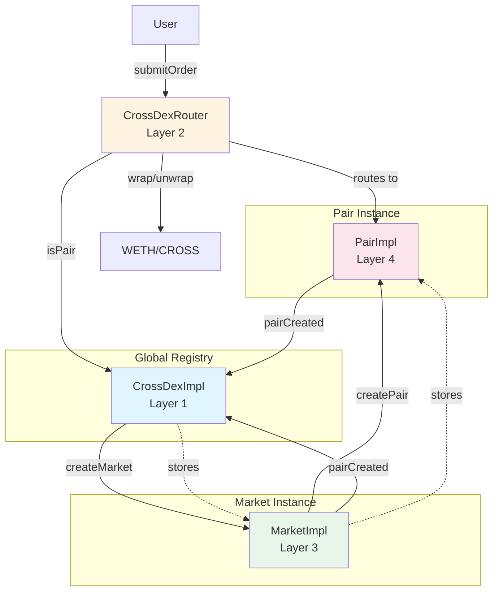
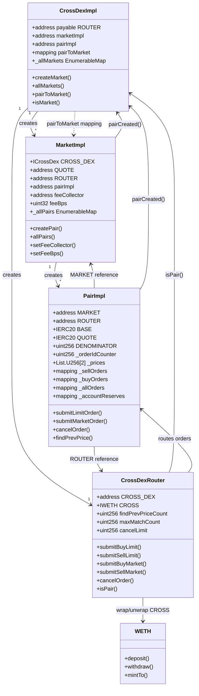
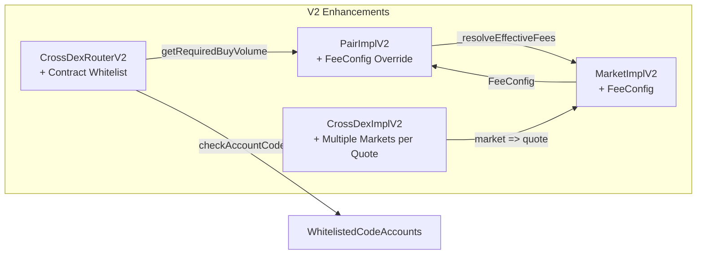

# Technical Documentation

This document provides detailed technical information about the DEX contract architecture and implementation.

## 📋 Table of Contents

- [Architecture Overview](#architecture-overview)
- [Contract Hierarchy](#contract-hierarchy)
- [Core Contracts](#core-contracts)
- [Data Structures](#data-structures)
- [Key Algorithms](#key-algorithms)
- [V2 Changes](#v2-changes)

## 🏗️ Architecture Overview

The DEX system follows a hierarchical architecture with four main layers:

1. **CrossDex Layer**: Global system manager
2. **Router Layer**: Order routing and validation
3. **Market Layer**: Market-level management and pair creation
4. **Pair Layer**: Order book management and matching

### System Flow

```
User → Router → Pair → Order Book Matching
           ↓
      Market (fee config)
           ↓
      CrossDex (global registry)
```

### Contract Relationship Diagram



## 📦 Contract Hierarchy

### Contract Structure Diagram



### Layer 1: CrossDexImpl

**Purpose**: Global system manager that creates and tracks all markets.

**Key Responsibilities:**
- Create and register markets
- Track all market addresses
- Manage implementation contracts (Market, Pair)
- Validate market addresses

**Key Storage Fields:**
- `ROUTER`: Immutable router address
- `marketImpl`, `pairImpl`: Implementation contract addresses
- `_allMarkets`: Mapping from quote token to market (V1: quote => market, V2: market => quote)
- `pairToMarket`: Mapping from pair to market
- `tickSizeSetter`: Address authorized to set tick sizes

**Key Functions:**
- `createMarket()`: Create a new market for a quote token (1:1 relationship)
- `allMarkets()`: Return all (quote, market) pairs
- `quoteToMarket()`: Get market for a specific quote token
- `isMarket()`: Verify if an address is a registered market

**Market Creation Process:**
1. Validates quote token is not already used (V1)
2. Uses Create2 with salt = `keccak256(quote)` (V1) or `keccak256(abi.encode(quote, message))` (V2) to deploy Market proxy
3. Initializes market with quote, feeCollector, and feeBps (V1) or feeData (V2)
4. Stores mapping: `_allMarkets.set(quote, market)` (V1) or `_allMarkets.set(market, quote)` (V2)

### Layer 2: CrossDexRouter

**Purpose**: Entry point for all trading operations.

**Key Responsibilities:**
- Validate and route orders to pairs
- Transfer tokens from users to pairs
- Handle native CROSS coin wrapping
- Enforce contract account restrictions

**Key Storage Fields:**
- `CROSS_DEX`: Immutable CrossDex reference
- `CROSS`: WETH wrapper for native CROSS coin
- `findPrevPriceCount`: Maximum price levels to search for limit order insertion
- `maxMatchCount`: Maximum number of matches per order execution
- `cancelLimit`: Maximum number of orders that can be cancelled per transaction
- `whitelistedCodeAccounts` (V2): Set of contract accounts allowed to interact with router

**Key Functions:**
- `submitBuyLimit()` / `submitSellLimit()`: Submit limit orders
- `submitBuyMarket()` / `submitSellMarket()`: Submit market orders
- `cancelOrder()`: Cancel pending orders (V2 adds `nonReentrant` modifier)
- `isPair()`: Validate pair address
- `getRequiredBuyVolume()` (V2): Calculate required QUOTE volume including buyer taker fee

**Security Modifiers:**
- `checkValue()`: Ensures router has no leftover native tokens after execution
- `validPair()`: Validates pair is registered in CrossDex

### Layer 3: MarketImpl

**Purpose**: Manages trading pairs and fee configuration for a specific market.

**Key Storage Fields:**
- `CROSS_DEX`: Immutable CrossDex reference
- `QUOTE`: Immutable quote token address
- `ROUTER`: Immutable router address
- `pairImpl`: Pair implementation contract address
- `feeCollector`: Address where fees are collected
- `feeBps` (V1): Single fee rate in basis points
- `_feeConfig` (V2): FeeConfig struct with 4 separate fee rates
- `_allPairs`: Mapping from base token to pair
- `deployed`: Block number when market was deployed

**Key Functions:**
- `createPair()`: Create a new trading pair (BASE/QUOTE)
  - V1: `createPair(address base, uint256 tickSize, uint256 lotSize)`
  - V2: `createPair(address base, uint256 tickSize, uint256 lotSize, bytes memory feeData)`
- `setFeeCollector()`: Update fee collection address
- `setFeeBps()`: Update fee rate (V1 only)
- `setMarketFees()`: Update all 4 fee rates (V2 only)
- `allPairs()`: List all pairs in the market

**Pair Creation Process:**
1. Validates base token (not zero, not quote, not duplicate)
2. Uses Create2 with salt = `keccak256(abi.encodePacked(base))` to deploy Pair proxy
3. Initializes pair with ROUTER, QUOTE, BASE, tickSize, lotSize (V1) or with additional feeData (V2)
4. Stores mapping: `_allPairs.set(base, pair)`
5. Registers pair in CrossDex via `pairCreated(pair)`

### Layer 4: PairImpl

**Purpose**: Core trading pair that maintains order books and executes matching.

**Key Storage Fields:**
- `MARKET`: Immutable market address
- `ROUTER`: Immutable router address
- `BASE`, `QUOTE`: Immutable token addresses
- `DENOMINATOR`: 10^BASE.decimals()
- `baseReserve`, `quoteReserve`: Total reserves tracked by the pair
- `matchedPrice`, `matchedAt`: Latest matched price and timestamp
- `tickSize`, `lotSize`: Price and quantity precision requirements
- `minTradeVolume`: Minimum trade volume calculated from tickSize and lotSize
- `_orderIdCounter`: Counter for generating unique order IDs
- `_prices`: Two price lists (index 0: sell orders ascending, index 1: buy orders descending)
- `_sellOrders`, `_buyOrders`: Mappings from price to order ID lists
- `_allOrders`: Mapping from order ID to Order struct
- `_accountReserves`: Mapping from account to [BASE reserve, QUOTE reserve]
- `feeConfig` (V2): Pair-specific fee configuration (can override market defaults)

**Order Structure:**
- `side`: OrderSide (SELL or BUY)
- `owner`: Order creator address
- `feeBps`: Fee rate in basis points (set when order is placed or matched)
- `price`: Limit price (0 for market orders)
- `amount`: Order quantity in base token units

**Key Functions:**
- `submitLimitOrder()`: Add order to order book
- `submitMarketOrder()`: Execute immediately at best price
- `cancelOrder()`: Remove order from order book
- `findPrevPrice()`: Price discovery for limit order insertion

## 📊 Data Structures

### Order Book Structure

The order book uses a custom `List` library for efficient price level management:

- **Price Levels**: Sorted using `List.U256`
  - Sell orders: Ascending price order (cheapest first)
  - Buy orders: Descending price order (most expensive first)
- **Same Price Orders**: FIFO ordering (chronological)
- **Access Pattern**: 
  - `_prices[0]`: Sell prices (ascending)
  - `_prices[1]`: Buy prices (descending)
  - `_sellOrders[price]`: Order IDs at specific sell price
  - `_buyOrders[price]`: Order IDs at specific buy price

### Account Reserves

Users deposit tokens into pairs before placing orders:
- `_accountReserves[account][0]`: BASE token reserve
- `_accountReserves[account][1]`: QUOTE token reserve
- Reserves are checked before order submission
- Reserves are updated during matching

## 🔄 Key Algorithms

### Order Matching Algorithm

**For Sell Orders:**
1. Search buy orders starting from highest price
2. Match at `buyOrder.price >= sellOrder.price`
3. Execute at buy order price (seller gets better price)
4. Continue until order filled or no more matches

**For Buy Orders:**
1. Search sell orders starting from lowest price
2. Match at `sellOrder.price <= buyOrder.price`
3. Execute at sell order price (buyer gets better price)
4. Continue until order filled or no more matches

**Matching Process:**
- Trade amount is the minimum of both orders' remaining amounts
- If target order is fully filled, it's removed from the order book
- Otherwise, target order's amount is decremented
- New order is marked as fully filled if trade amount equals order amount, otherwise decremented
- `OrderMatched` event is emitted with trade details

### Fee Collection

**V1:**
- Uses single `_exchangeQuote()` function for both buy and sell orders
- Fee is calculated as `amount * feeBps / 10000`
- Fee and remaining value are transferred immediately during matching
- Fee is always deducted from QUOTE token

**V2:**
- Separate `_exchangeSellOrder()` and `_exchangeBuyOrder()` functions
- Different fee rates apply based on maker/taker role and order side
- Fees are accumulated during matching and returned from exchange functions
- Fees are transferred in a single batch at the end of matching for gas efficiency
- For buy orders, BASE token is transferred first, then fee is calculated on QUOTE amount

**Fee Calculation:**
- Fee is always deducted from QUOTE token
- For sell orders: Fee from QUOTE received
- For buy orders: Fee from QUOTE spent
- V2: Fee rates differ based on maker/taker and buy/sell
- V2: Fees are accumulated during matching and transferred in a single batch at the end for gas efficiency

### Price Discovery (findPrevPrice)

Used for inserting limit orders at the correct price level:

1. Search existing price levels
2. Find the best price that matches order constraints
3. Return price for order book insertion
4. Optimized with `findPrevPriceCount` limit to control gas costs

### Native CROSS Handling

The DEX uses a WETH wrapper contract for native CROSS coin:

**Wrapping Process:**
- User sends native CROSS with transaction (`{value: amount}`)
- Router calls `CROSS.mintTo{value: amount}(pair)` to wrap native CROSS to ERC20
- Wrapped CROSS exists as ERC20 tokens within pairs

**Unwrapping Process:**
- When pair transfers CROSS to a non-pair address, WETH's `_update()` hook detects the transfer
- WETH automatically burns ERC20 tokens and sends native CROSS coin to the recipient
- This allows seamless native coin experience for users while maintaining ERC20 compatibility within pairs

## 🔧 V2 Changes

### V2 Contract Relationship Diagram



### 1. Market Mapping Reversal

**V1:**
- `_allMarkets` mapping: quote => market (1:1 relationship)
- `quoteToMarket()` function provides direct lookup
- `isMarket()` checks via quote lookup

**V2:**
- `_allMarkets` mapping: market => quote (allows multiple markets per quote)
- `quoteToMarket()` function removed
- `isMarket()` checks direct mapping via `_allMarkets.contains(market)`

**Impact:**
- Multiple markets can exist for the same quote token
- Market lookup requires iterating `allMarkets()` instead of direct lookup
- `createMarket()` API changed:
  - V1: `createMarket(address _owner, address quote, address feeCollector, uint256 feeBps)`
  - V2: `createMarket(address _owner, address quote, address feeCollector, bytes memory feeData, string memory message)`
- `allMarkets()` return order changed: V1 returns `(quotes[], markets[])`, V2 returns `(markets[], quotes[])`
- `isMarket()` implementation changed: V1 checks via quote lookup, V2 checks direct mapping

### 2. Fee Structure Enhancement

**V1:**
- Single `feeBps` field storing one fee rate for all trades

**V2:**
- `FeeConfig` struct with 4 separate fee rates:
  - `sellerMakerFeeBps`: Fee for sell orders acting as maker
  - `sellerTakerFeeBps`: Fee for sell orders acting as taker
  - `buyerMakerFeeBps`: Fee for buy orders acting as maker
  - `buyerTakerFeeBps`: Fee for buy orders acting as taker
- Validation: `takerFee >= makerFee` for both sides (enforced at market and pair level)
- Pair-level fee override: Pairs can set their own fees or use `NO_FEE_BPS` to inherit from market
- `createMarket()` now takes `bytes memory feeData` (encoded 4 uint32 values) instead of `uint256 feeBps`

**Fee Resolution in Pair:**
- Pairs resolve effective fees via `_resolveEffectiveFees()`:
  1. Resolve `NO_FEE_BPS` values to market defaults
  2. Ensure `taker >= maker` invariant by adjusting inherited values if needed
- If pair has explicit fee and inherited fee conflicts (maker > taker), pair-specified value takes precedence

### 3. Contract Account Whitelisting

**V1:**
- `checkValue()` modifier only checks for leftover native tokens
- No contract account restriction - all accounts (EOA and smart contracts) can interact

**V2:**
- `checkSubmit()` modifier replaces `checkValue()` and includes `_checkAccountCode()` check
- `_checkAccountCode()`: If account has code (is a contract) and is not whitelisted, revert
- `setWhitelistedCodeAccount()`: Owner can whitelist contract accounts for composability
- Note: Contracts calling router from constructor may bypass check (code.length is 0 during construction)

**Impact:**
- V1: All accounts (including smart contracts) could interact with router
- V2: Smart contracts are blocked by default, but can interact if whitelisted
- Provides controlled access for composability with other DeFi protocols
- Controlled via owner-managed whitelist

### 4. Router Buy Order Fee Calculation

**V1:**
- Router doesn't calculate fees upfront
- Pair calculates fee during matching

**V2:**
- Router includes fee in required volume calculation
- New function: `getRequiredBuyVolume()` - calculates total needed including buyer taker fee
- Pair validates sufficient funds including fee

**Implementation:**
- New `getRequiredBuyVolume()` function: Calculates total QUOTE volume needed including buyer taker fee
- Used by `submitBuyLimit()` and `submitBuyMarket()` to transfer correct amount upfront
- Formula: `quoteVolume + (quoteVolume * buyerTakerFeeBps / BPS_DENOMINATOR)`
- Pair validates that user transferred sufficient funds including fee during order execution

## 🔐 Security Considerations

### Upgradeability

All contracts use UUPS (Universal Upgradeable Proxy Standard) pattern:
- Implementation contracts are separate from proxy contracts
- Storage layout must be maintained across upgrades
- Storage gaps reserved for future variables

### Reentrancy Protection

All state-changing functions use `nonReentrant` modifier from OpenZeppelin:
- Prevents reentrancy attacks during order execution
- Applied at router level for all user-facing functions

### Access Control

- **CrossDex**: Only owner can create markets and update implementations
- **Market**: Only owner can create pairs and update fees
- **Router**: Only owner can update parameters and whitelist contracts
- **Pair**: Only market owner can update fees (pair-level)

### Input Validation

Comprehensive validation throughout:
- Address checks (not zero address)
- Amount checks (greater than zero)
- Price checks (divisible by tickSize)
- Amount checks (divisible by lotSize)
- Fee validation (taker >= maker in V2)

## 🚀 Performance Optimizations

### Gas Optimization

1. **Storage Packing**: Efficient storage layout (struct packing)
2. **List Library**: Custom implementation for order book operations
3. **Price Discovery Limits**: `findPrevPriceCount` limits gas for price search
4. **Match Count Limits**: `maxMatchCount` prevents excessive gas usage
5. **Batch Cancellation**: `cancelLimit` for efficient multi-order cancellation

### Scalability

- Order book scales to large number of orders through efficient data structures
- FIFO matching ensures fair order execution
- Price-level organization minimizes traversal costs

---

**Note**: For contract source code and detailed function signatures, please refer to the `src/` directory.

