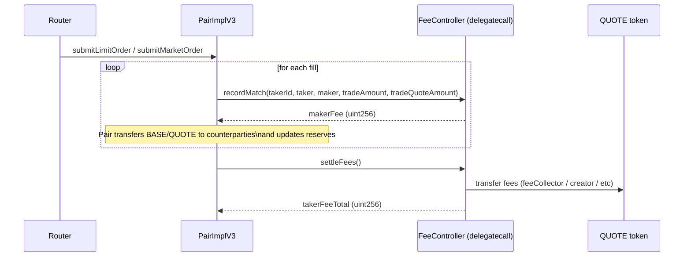

# Fees (V3 FeeController)

V3 replaces the V1/V2 in-contract fee configuration with a **pluggable FeeController** executed via `delegatecall` from `PairImplV3`.

This document explains:

- the FeeController interface and lifecycle
- how fees affect deposits, matching, and refunds
- the two shipped fee policies (`V2Compat` and `V3Split`)
- how to configure and upgrade fee controllers safely

## 📋 Table of Contents

- [FeeController Overview](#-feecontroller-overview)
- [Fee Lifecycle in a Trade](#-fee-lifecycle-in-a-trade)
- [Buy Deposits: "Volume With Fee"](#-buy-deposits-volume-with-fee)
- [FeeControllerV2Compat (V2-like 4-bps model)](#-feecontrollerv2compat-v2-like-4-bps-model)
- [FeeControllerV3Split (taker-only 3-way split)](#-feecontrollerv3split-taker-only-3-way-split)
- [Allow-list and Safety Checks](#-allow-list-and-safety-checks)
- [Configuration Examples](#-configuration-examples)

## 🧩 FeeController Overview

`PairImplV3` holds:

- `IFeeController public feeController;` (an address)

The Pair calls FeeController methods via `delegatecall` wrappers:

- `initialize(quote, denominator, initData)` — set/update fee config
- `calcBuyVolumeWithFee(isMaker, volume|order)` — compute total QUOTE required
- `recordMatch(...)` — per-fill hook, returns maker fee for this fill
- `settleFees()` — end-of-match hook, transfers accumulated fees

### Why `delegatecall`?

FeeController is treated as **pure policy code**. By running it in Pair context:

- the controller can store configuration in Pair storage (namespaced via ERC-7201)
- per-tx accumulators can use transient storage (EIP-1153) without touching Pair’s permanent state
- Pair upgrades can keep the matching engine stable while the fee policy evolves

## 🔄 Fee Lifecycle in a Trade

Matching flow in `PairImplV3` (simplified):



Important:

- **All fee transfers are done in QUOTE token**.
- `recordMatch` can also perform immediate transfers (e.g., maker rebates in V3Split).

## 🧮 Buy Deposits: "Volume With Fee"

In an order book, a BUY limit order can become a **taker** immediately (if it crosses the best ask).
Therefore, the Router pre-funds BUY submissions using **taker fee** assumptions.

Terminology:

- `DENOMINATOR = 10 ** BASE.decimals()`
- `baseVolume = price * amount / DENOMINATOR` (in QUOTE units)
- `buyVolumeWithFee = baseVolume + fee(baseVolume)`

In V3, Router uses:

- `Pair.calcBuyVolumeWithFee(volume)` which delegates to FeeController with `isMaker = false` (taker fee).

This ensures BUY submissions have enough QUOTE even if they match immediately.

## 🧾 FeeControllerV2Compat (V2-like 4-bps model)

**Purpose:** match V2 behavior: 4 independent fee rates:

- seller maker fee bps
- seller taker fee bps
- buyer maker fee bps
- buyer taker fee bps

### Policy rules

- Fees are in **basis points** (BPS), `BPS_DENOMINATOR = 10000`.
- Validation:
  - `sellerTakerFeeBps >= sellerMakerFeeBps`
  - `buyerTakerFeeBps >= buyerMakerFeeBps`

### How maker fees work (V2 compatibility)

In V2Compat, the **maker fee bps** is stored into the maker order at creation time:

- SELL limit order stores `order.feeBps = sellerMakerFeeBps`
- BUY limit order stores `order.feeBps = buyerMakerFeeBps`

Then, during each fill:

- `makerFee = tradeQuoteAmount * maker.feeBps / 10000`
- `takerFee = tradeQuoteAmount * takerFeeBps(taker.side) / 10000`

The FeeController accumulates maker+taker fees in transient storage and transfers them to `feeCollector` in `settleFees()`.

### Refund behavior on cancel (BUY limit)

For a BUY limit order that remains on the book, the deposited QUOTE includes **maker fee pre-funding**.
On cancellation, Pair refunds:

- `returnQuote = price * remainingAmount / DENOMINATOR`
- plus the maker fee portion using `order.feeBps`

This is why V2Compat stores maker fee bps in the order itself.

## 🧾 FeeControllerV3Split (taker-only 3-way split)

**Purpose:** a modern policy where **makers pay no fee** and **takers pay a single fee** that is split:

- creator fee (paid to `creator`)
- maker rebate (paid immediately to the maker)
- system fee (paid to `feeCollector`)

### Policy rules

- Maker fee is always **0**.
- Taker fee is `takerFeeBps` on `tradeQuoteAmount`.
- Split is expressed as shares of the *taker fee*:
  - `creatorShareBps`
  - `makerRebateShareBps`
  - system gets the remainder
- Validation:
  - `creatorShareBps + makerRebateShareBps <= 10000`

### Immediate maker rebate

During `recordMatch`, V3Split computes the taker fee and pays the maker rebate immediately:

- `rebate = takerFee * makerRebateShareBps / 10000`
- `QUOTE.transfer(maker.owner, rebate)` (executed from Pair context via delegatecall)

This means makers receive rebates **during matching**, not at the end.

### Settlement

In `settleFees()`:

- `creatorFee = takerFeeTotal * creatorShareBps / 10000`
- `feeCollectorFee = takerFeeTotal - creatorFee - makerRebatePaidTotal`

Then transfers:

- `creatorFee` → `creator`
- `feeCollectorFee` → `feeCollector`

## ✅ Allow-list and Safety Checks

FeeControllers are gated at the CrossDex level:

- `CrossDexImplV3` stores an allow-list of FeeController addresses.
- `MarketImplV3` and `PairImplV3` require new FeeControllers to be allowed by CrossDex.

This matters especially for upgrades:

- after upgrading CrossDex to V3, the allow-list starts empty
- you must call `CrossDexImplV3.setFeeControllerAllow(feeController, true)` before setting it on Markets/Pairs

## 🧪 Configuration Examples

### V2Compat init data

```solidity
bytes memory initData = abi.encode(
    feeCollector,         // address
    sellerMakerFeeBps,    // uint32
    sellerTakerFeeBps,    // uint32
    buyerMakerFeeBps,     // uint32
    buyerTakerFeeBps      // uint32
);
```

### V3Split init data

```solidity
bytes memory initData = abi.encode(
    feeCollector,         // address (system fee recipient)
    creator,              // address (creator fee recipient)
    takerFeeBps,          // uint32 (e.g., 100 = 1%)
    creatorShareBps,      // uint32 (share of taker fee, e.g., 3000 = 30%)
    makerRebateShareBps   // uint32 (share of taker fee, e.g., 2000 = 20%)
);
```

