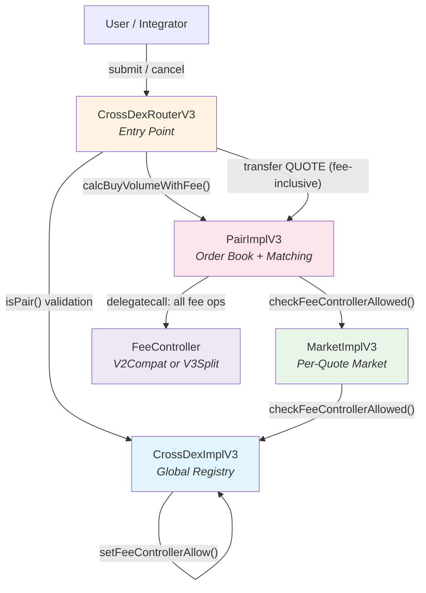
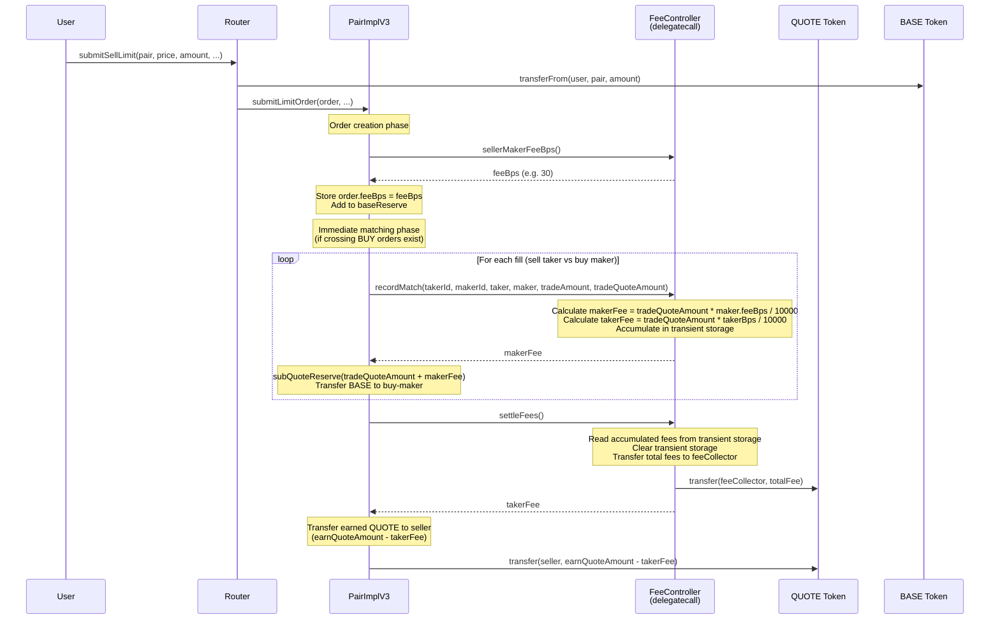
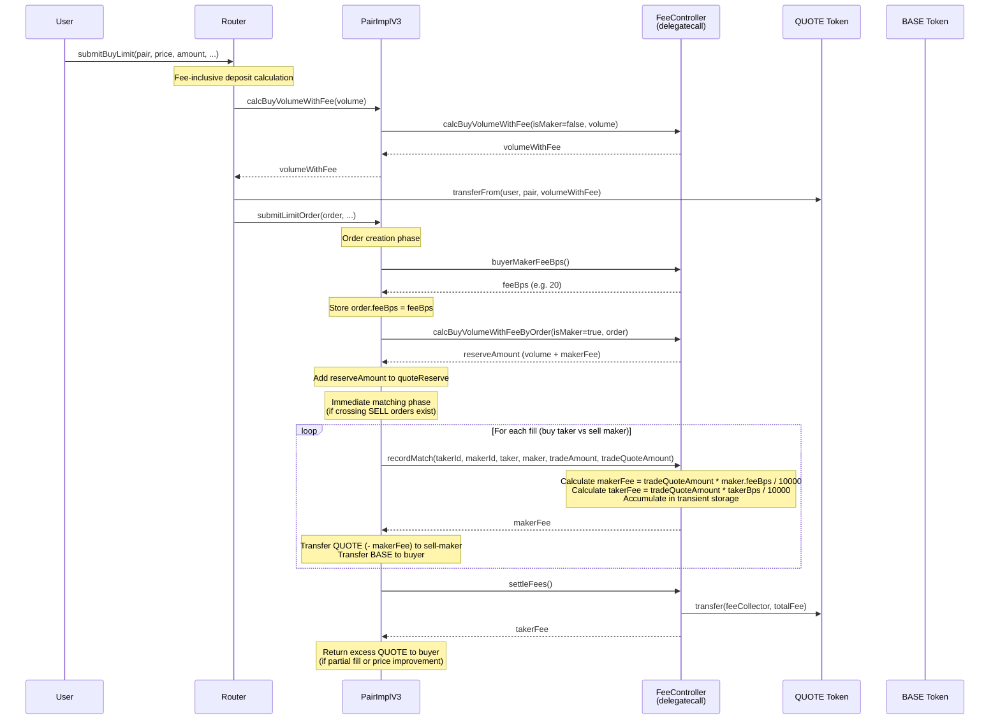
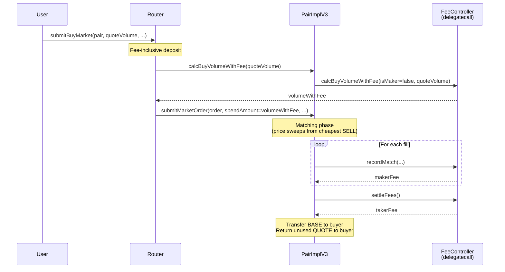

# Fees (V3 FeeController)

V3 replaces the V1/V2 in-contract fee configuration with a **pluggable FeeController** executed via `delegatecall` from `PairImplV3`.

This document explains:

- the FeeController interface and lifecycle
- how fees affect deposits, matching, and refunds
- the two shipped fee policies (`V2Compat` and `V3Split`)
- how to configure and upgrade fee controllers safely
- the complete cross-contract fee flow with diagrams
- storage patterns used across contracts
- integration guidance for external systems

## 📋 Table of Contents

- [Contract Responsibility Map](#-contract-responsibility-map)
- [FeeController Overview](#-feecontroller-overview)
- [Complete Cross-Contract Fee Flow](#-complete-cross-contract-fee-flow)
- [Fee Lifecycle per Order Type](#-fee-lifecycle-per-order-type)
- [Buy Deposits: "Volume With Fee"](#-buy-deposits-volume-with-fee)
- [FeeControllerV2Compat (V2-like 4-bps model)](#-feecontrollerv2compat-v2-like-4-bps-model)
- [FeeControllerV3Split (taker-only 3-way split)](#-feecontrollerv3split-taker-only-3-way-split)
- [Cancel and Refund Paths](#-cancel-and-refund-paths)
- [Storage Patterns](#-storage-patterns)
- [Allow-list and Safety Checks](#-allow-list-and-safety-checks)
- [Configuration Examples](#-configuration-examples)
- [Integration Guide](#-integration-guide)

---

## 🗺️ Contract Responsibility Map

Fee logic spans **5 contracts**, each with a specific role:

| Contract | Role | Fee Responsibilities |
|---|---|---|
| **CrossDexImplV3** | Global registry | Maintains FeeController allow-list (`_allowedFeeControllers`). Validates FeeController addresses via ERC-165 before allowing. |
| **CrossDexRouterV3** | User-facing entry point | Calls `calcBuyVolumeWithFee()` to compute fee-inclusive deposit amounts for BUY orders. Transfers fee-inclusive QUOTE to the Pair. |
| **MarketImplV3** | Per-quote-token factory | Propagates FeeController changes to Pairs. Validates against CrossDex allow-list on FeeController set. |
| **PairImplV3** | Order book + matching engine | Orchestrates fee flow: stores `order.feeBps` at creation, calls FeeController via `delegatecall` during matching, manages reserves, handles refunds on cancel. |
| **FeeController** (V2Compat / V3Split) | Fee policy (delegatecall target) | Pure policy code: calculates fees, accumulates per-tx totals in transient storage, transfers fees to collectors. Runs in Pair's storage context. |

### Contract Interaction Diagram



---

## 🧩 FeeController Overview

`PairImplV3` holds:

- `IFeeController public feeController;` (an address)

The Pair calls FeeController methods via `delegatecall` wrappers:

- `initialize(quote, denominator, initData)` — set/update fee config
- `calcBuyVolumeWithFee(isMaker, volume|order)` — compute total QUOTE required
- `recordMatch(...)` — per-fill hook, returns maker fee for this fill
- `settleFees()` — end-of-match hook, transfers accumulated fees

### Why `delegatecall`?

FeeController is treated as **pure policy code**. By running it in Pair context:

- the controller can store configuration in Pair storage (namespaced via ERC-7201)
- per-tx accumulators can use transient storage (EIP-1153) without touching Pair's permanent state
- Pair upgrades can keep the matching engine stable while the fee policy evolves

### IFeeController Interface

```solidity
uint256 constant BPS_DENOMINATOR = 10000;

interface IFeeController {
    function initialize(address quote, uint256 denominator, bytes memory initData) external;
    function calcBuyVolumeWithFeeByOrder(bool isMaker, Order memory order) external view returns (uint256);
    function calcBuyVolumeWithFee(bool isMaker, uint256 volume) external view returns (uint256);
    function recordMatch(
        uint256 takerId, uint256 makerId,
        Order memory taker, Order memory maker,
        uint256 tradeAmount, uint256 tradeQuoteAmount
    ) external returns (uint256 makerFee);
    function settleFees() external returns (uint256 takerFee);
    function sellerMakerFeeBps() external view returns (uint32);
    function buyerMakerFeeBps() external view returns (uint32);
    function getEffectiveFees() external view returns (uint32, uint32, uint32, uint32);
    function getConfigId() external view returns (bytes32);
    function getStorage() external view returns (bytes memory);
}
```

### Delegatecall Wrappers in PairImplV3

All fee operations go through private wrapper functions that use `Address.functionDelegateCall`:

| Wrapper Function | Delegates To | Returns |
|---|---|---|
| `_feeControllerInitialize(bytes)` | `initialize()` | — |
| `_feeControllerCalcBuyVolumeWithFee(bool, uint256)` | `calcBuyVolumeWithFee()` | `uint256 buyVolume` |
| `_feeControllerCalcBuyVolumeWithFeeOrder(bool, Order)` | `calcBuyVolumeWithFeeByOrder()` | `uint256 buyVolume` |
| `_feeControllerRecordMatch(...)` | `recordMatch()` | `uint256 makerFee` |
| `_feeControllerSettleFees()` | `settleFees()` | `uint256 takerFee` |
| `_feeControllerSellerMakerFeeBps()` | `sellerMakerFeeBps()` | `uint32` |
| `_feeControllerBuyerMakerFeeBps()` | `buyerMakerFeeBps()` | `uint32` |

---

## 🔄 Complete Cross-Contract Fee Flow

### End-to-End: SELL Limit Order



### End-to-End: BUY Limit Order



### End-to-End: BUY Market Order



---

## 📊 Fee Lifecycle per Order Type

### Timing Summary

| Order Type | Fee Reserved At | Fee Charged At | Fee Returned On Cancel |
|---|---|---|---|
| **SELL Limit** (maker) | — | Execution (matching) | N/A (BASE returned, no fee) |
| **SELL Limit** (becomes taker) | — | Immediate matching | N/A |
| **SELL Market** (always taker) | — | Execution (matching) | N/A (unused BASE returned) |
| **BUY Limit** (maker) | Order creation (maker fee pre-funded) | Execution (matching) | Yes, via `order.feeBps` |
| **BUY Limit** (becomes taker) | Order creation (taker fee pre-funded) | Immediate matching | Excess returned |
| **BUY Market** (always taker) | Submission (taker fee pre-funded by Router) | Execution (matching) | Unused QUOTE returned |

### SELL Order Fee Flow (Detailed)

```
1. DEPOSIT:  User deposits BASE only (no fee involved)
             → baseReserve += order.amount

2. CREATION: order.feeBps = sellerMakerFeeBps()
             (stored for future use if this order becomes a maker)

3. MATCHING (as taker, immediate):
   For each fill:
     ├─ recordMatch() → takerFee accumulated (sellerTakerFeeBps)
     ├─ makerFee returned (from BUY maker's feeBps)
     └─ quoteReserve -= (tradeQuoteAmount + makerFee)

   settleFees() → takerFee transferred to feeCollector
   Seller receives: earnQuoteAmount - takerFee

4. MATCHING (as maker, later):
   For each fill:
     ├─ recordMatch() → makerFee = tradeQuoteAmount * order.feeBps / 10000
     └─ makerFee accumulated in transient storage

   Seller receives: tradeQuoteAmount - makerFee

5. CANCEL:   BASE returned to owner
             baseReserve -= order.amount
             (No fee involved — fee was never pre-funded for SELL)
```

### BUY Order Fee Flow (Detailed)

```
1. DEPOSIT:  Router calculates fee-inclusive amount:
             volumeWithFee = volume + (volume * takerFeeBps / 10000)
             User deposits QUOTE including taker fee
             → quoteReserve += calcBuyVolumeWithFeeByOrder(isMaker=true, order)
             (Note: reserve uses maker fee, not taker fee)

2. CREATION: order.feeBps = buyerMakerFeeBps()
             (stored for cancel refund and maker fee calculation)

3. MATCHING (as taker, immediate):
   For each fill:
     ├─ recordMatch() → takerFee accumulated (buyerTakerFeeBps)
     ├─ makerFee returned (from SELL maker's feeBps)
     └─ BASE transferred to buyer

   settleFees() → takerFee transferred to feeCollector
   Buyer receives: BASE tokens

4. MATCHING (as maker, later):
   For each fill:
     ├─ recordMatch() → makerFee = tradeQuoteAmount * order.feeBps / 10000
     ├─ makerFee accumulated in transient storage
     └─ quoteReserve -= (tradeQuoteAmount + makerFee)

   Buyer receives: BASE tokens

5. CANCEL:   QUOTE returned to owner, including maker fee pre-funding:
             returnQuote = (price * amount / DENOMINATOR)
             if (order.feeBps != 0):
                 returnQuote += returnQuote * order.feeBps / BPS_DENOMINATOR
             quoteReserve -= returnQuote
```

### Why Taker Fee Is Pre-funded for BUY Limits

A BUY limit order may **immediately cross** existing SELL orders (becoming a taker). The Router cannot know in advance whether the order will be a maker or taker, so it pre-funds with the **taker fee** (which is always >= maker fee).

- If the order matches immediately (taker): taker fee is used
- If the order rests on the book (maker): excess QUOTE (taker fee - maker fee portion) is returned to the user via `_returnRemainQuote()`

---

## 🧮 Buy Deposits: "Volume With Fee"

In an order book, a BUY limit order can become a **taker** immediately (if it crosses the best ask).
Therefore, the Router pre-funds BUY submissions using **taker fee** assumptions.

Terminology:

- `DENOMINATOR = 10 ** BASE.decimals()`
- `baseVolume = price * amount / DENOMINATOR` (in QUOTE units)
- `buyVolumeWithFee = baseVolume + fee(baseVolume)`

In V3, Router uses:

- `Pair.calcBuyVolumeWithFee(volume)` which delegates to FeeController with `isMaker = false` (taker fee).

This ensures BUY submissions have enough QUOTE even if they match immediately.

### Fee Calculation Formula

```
fee = Math.mulDiv(amount, feeBps, BPS_DENOMINATOR)
totalWithFee = amount + fee
```

Where `BPS_DENOMINATOR = 10000` (1 bps = 0.01%).

---

## 🧾 FeeControllerV2Compat (V2-like 4-bps model)

**Purpose:** match V2 behavior: 4 independent fee rates:

- seller maker fee bps
- seller taker fee bps
- buyer maker fee bps
- buyer taker fee bps

**Config ID:** `"FeeControllerV2Compat.v1"`

### Policy rules

- Fees are in **basis points** (BPS), `BPS_DENOMINATOR = 10000`.
- Validation:
  - `sellerTakerFeeBps >= sellerMakerFeeBps`
  - `buyerTakerFeeBps >= buyerMakerFeeBps`
  - All bps values < 10000

### Fee Rate Selection Logic

| Who | Role in Match | Fee Rate Used |
|---|---|---|
| SELL order | Maker (resting) | `sellerMakerFeeBps` (from `order.feeBps`) |
| SELL order | Taker (immediate) | `sellerTakerFeeBps` |
| BUY order | Maker (resting) | `buyerMakerFeeBps` (from `order.feeBps`) |
| BUY order | Taker (immediate) | `buyerTakerFeeBps` |

### How maker fees work (V2 compatibility)

In V2Compat, the **maker fee bps** is stored into the maker order at creation time:

- SELL limit order stores `order.feeBps = sellerMakerFeeBps`
- BUY limit order stores `order.feeBps = buyerMakerFeeBps`

Then, during each fill:

- `makerFee = tradeQuoteAmount * maker.feeBps / 10000`
- `takerFee = tradeQuoteAmount * takerFeeBps(taker.side) / 10000`

The FeeController accumulates maker+taker fees in transient storage and transfers them to `feeCollector` in `settleFees()`.

### recordMatch() Flow (V2Compat)

```
recordMatch(takerId, makerId, taker, maker, tradeAmount, tradeQuoteAmount):
  1. First call in a match set:
     ├─ Store takerId in transient storage
     ├─ Determine takerFeeBps based on taker.side
     │   ├─ SELL taker → sellerTakerFeeBps
     │   └─ BUY taker → buyerTakerFeeBps
     └─ Cache takerFeeBps in transient storage

  2. Subsequent calls:
     ├─ Verify takerId matches (safety check)
     └─ Read cached takerFeeBps

  3. Calculate fees:
     ├─ makerFee = tradeQuoteAmount * maker.feeBps / 10000
     ├─ takerFee = tradeQuoteAmount * takerFeeBps / 10000
     ├─ makerFeeAcc += makerFee   (transient storage)
     └─ takerFeeAcc += takerFee   (transient storage)

  4. Return makerFee
```

### settleFees() Flow (V2Compat)

```
settleFees():
  1. Read from transient storage:
     ├─ takerId
     ├─ makerFeeAcc
     └─ takerFeeAcc

  2. Effects (CEI pattern):
     └─ Clear all transient storage slots to 0

  3. Interactions:
     └─ QUOTE.transfer(feeCollector, makerFeeAcc + takerFeeAcc)

  4. Emit FeeControllerFeesSettled(takerId, feeCollector, totalFee)
  5. Return takerFeeAcc
```

### Refund behavior on cancel (BUY limit)

For a BUY limit order that remains on the book, the deposited QUOTE includes **maker fee pre-funding**.
On cancellation, Pair refunds:

- `returnQuote = price * remainingAmount / DENOMINATOR`
- plus the maker fee portion using `order.feeBps`

This is why V2Compat stores maker fee bps in the order itself.

---

## 🧾 FeeControllerV3Split (taker-only 3-way split)

**Purpose:** a modern policy where **makers pay no fee** and **takers pay a single fee** that is split:

- creator fee (paid to `creator`)
- maker rebate (paid immediately to the maker)
- system fee (paid to `feeCollector`)

**Config ID:** `"FeeControllerV3Split.v1"`

### Policy rules

- Maker fee is always **0**.
- Taker fee is `takerFeeBps` on `tradeQuoteAmount`.
- Split is expressed as shares of the *taker fee*:
  - `creatorShareBps`
  - `makerRebateShareBps`
  - system gets the remainder
- Validation:
  - `creatorShareBps + makerRebateShareBps <= 10000`

### Fee Rate Selection Logic

| Who | Role in Match | Fee Rate Used |
|---|---|---|
| Any order | Maker (resting) | **0** (no maker fee) |
| Any order | Taker (immediate) | `takerFeeBps` (uniform) |

### recordMatch() Flow (V3Split)

```
recordMatch(takerId, makerId, taker, maker, tradeAmount, tradeQuoteAmount):
  1. Validate/set takerId in transient storage (same as V2Compat)

  2. Calculate taker fee:
     └─ takerFee = tradeQuoteAmount * takerFeeBps / 10000

  3. Accumulate takerFee in transient storage

  4. Immediate maker rebate:
     ├─ rebate = takerFee * makerRebateShareBps / 10000
     ├─ Accumulate rebate total in transient storage
     ├─ QUOTE.transfer(maker.owner, rebate)    ← IMMEDIATE TRANSFER
     └─ Emit FeeControllerV3MakerRebatePaid(makerId, maker.owner, rebate)

  5. Return 0 (makerFee is always 0 in V3Split)
```

> **Important:** Maker rebates are paid **during matching** (inside `recordMatch`), not at settlement. This is a key difference from V2Compat.

### settleFees() Flow (V3Split)

```
settleFees():
  1. Read from transient storage:
     ├─ takerId
     ├─ takerFeeAccTotal
     └─ makerRebatePaidTotal

  2. Effects (CEI pattern):
     └─ Clear all transient storage slots to 0

  3. Calculate distribution:
     ├─ creatorFee = takerFeeAccTotal * creatorShareBps / 10000
     └─ feeCollectorFee = takerFeeAccTotal - creatorFee - makerRebatePaidTotal

  4. Interactions:
     ├─ QUOTE.transfer(creator, creatorFee)
     └─ QUOTE.transfer(feeCollector, feeCollectorFee)

  5. Emit FeeControllerV3FeesSettled(takerId, totalTakerFee, creatorFee, feeCollectorFee, makerRebatePaidTotal, creator, feeCollector)
  6. Return takerFeeAccTotal
```

### Taker Fee Distribution Example

If `takerFeeBps = 100` (1%), `creatorShareBps = 3000` (30%), `makerRebateShareBps = 2000` (20%):

```
Trade: 10,000 QUOTE
  ├─ takerFee = 100 QUOTE (1%)
  │
  ├─ makerRebate = 20 QUOTE (20% of takerFee) → paid to maker during matching
  ├─ creatorFee  = 30 QUOTE (30% of takerFee) → paid to creator at settlement
  └─ systemFee   = 50 QUOTE (remaining 50%)   → paid to feeCollector at settlement
```

---

## 🔁 Cancel and Refund Paths

### SELL Order Cancel

```
_cancelOrder(orderId, order):
  ├─ amount = order.amount (remaining BASE)
  ├─ baseReserve -= amount
  └─ BASE.transfer(order.owner, amount)

  No fee involved. SELL orders never pre-fund fees.
```

### BUY Order Cancel

```
_cancelOrder(orderId, order):
  ├─ returnQuoteAmount = price * amount / DENOMINATOR
  ├─ if (order.feeBps != 0):
  │   └─ returnQuoteAmount += returnQuoteAmount * order.feeBps / BPS_DENOMINATOR
  ├─ quoteReserve -= returnQuoteAmount
  └─ QUOTE.transfer(order.owner, returnQuoteAmount)

  The fee portion stored in order.feeBps is refunded to the user.
```

### Refund Comparison

| Scenario | What Is Refunded | Fee Handling |
|---|---|---|
| SELL cancel | Remaining BASE | No fee to refund |
| BUY cancel | QUOTE + maker fee portion | `order.feeBps` used to compute maker fee refund |
| SELL partial fill (maker) | Remaining BASE at cancel | Executed portion had fee deducted |
| BUY partial fill (maker) | Remaining QUOTE + fee at cancel | Executed portion had fee deducted |
| BUY limit (excess from taker→maker) | Excess QUOTE via `_returnRemainQuote()` | Difference between taker and maker fee pre-funding |

---

## 💾 Storage Patterns

The fee system uses three distinct storage patterns, each for a specific purpose:

### 1. Regular Contract Storage (PairImplV3)

| Variable | Type | Purpose |
|---|---|---|
| `feeController` | `IFeeController` | Address of the active FeeController implementation |
| `baseReserve` | `uint256` | Total BASE held for open SELL orders |
| `quoteReserve` | `uint256` | Total QUOTE held for open BUY orders (fee-inclusive) |
| `_allOrders[id].feeBps` | `uint32` | Maker fee bps snapshot at order creation |

### 2. ERC-7201 Namespaced Persistent Storage (FeeControllers)

Both FeeController implementations use ERC-7201 to isolate their configuration from Pair's own storage. This is critical because FeeControllers execute via `delegatecall` and share the Pair's storage context.

**FeeControllerV2Compat:**

```
Namespace: "cross.storage.FeeControllerV2Compat"
Slot: keccak256("cross.storage.FeeControllerV2Compat") - 1) & ~bytes32(uint256(0xff))

┌─────────────────────────────────────────────┐
│ FeeControllerV2CompatStorage                │
├─────────────────────────────────────────────┤
│ address  feeCollector                       │
│ uint32   sellerMakerFeeBps                  │
│ uint32   sellerTakerFeeBps                  │
│ uint32   buyerMakerFeeBps                   │
│ uint32   buyerTakerFeeBps                   │
│ IERC20   quote        (cached from Pair)    │
│ uint256  denominator  (cached from Pair)    │
└─────────────────────────────────────────────┘
```

**FeeControllerV3Split:**

```
Namespace: "cross.storage.FeeControllerV3Split"
Slot: keccak256("cross.storage.FeeControllerV3Split") - 1) & ~bytes32(uint256(0xff))

┌─────────────────────────────────────────────┐
│ FeeControllerV3SplitStorage                 │
├─────────────────────────────────────────────┤
│ address  feeCollector                       │
│ address  creator                            │
│ uint32   takerFeeBps                        │
│ uint32   creatorShareBps                    │
│ uint32   makerRebateShareBps                │
│ IERC20   quote        (cached from Pair)    │
│ uint256  denominator  (cached from Pair)    │
└─────────────────────────────────────────────┘
```

### 3. ERC-7201 Namespaced Transient Storage (EIP-1153)

Per-transaction fee accumulators use transient storage to avoid permanent writes. These are automatically cleared at the end of each transaction.

**FeeControllerV2Compat Transient Layout:**

```
Base slot: keccak256("cross.transient.FeeControllerV2Compat") - 1) & ~bytes32(uint256(0xff))

Slot + 0: currentTakerId   (uint256)  — taker order ID for this match set
Slot + 1: takerFeeBps      (uint32)   — cached taker fee rate
Slot + 2: makerFeeAcc      (uint256)  — accumulated maker fees
Slot + 3: takerFeeAcc      (uint256)  — accumulated taker fees
```

**FeeControllerV3Split Transient Layout:**

```
Base slot: keccak256("cross.transient.FeeControllerV3Split") - 1) & ~bytes32(uint256(0xff))

Slot + 0: currentTakerId        (uint256)  — taker order ID for this match set
Slot + 1: takerFeeAccTotal      (uint256)  — accumulated total taker fees
Slot + 2: makerRebatePaidTotal  (uint256)  — accumulated maker rebates already paid
```

### Storage Pattern Summary

```
┌─────────────────────────────────────────────────────────────────────┐
│                        Pair Storage Context                         │
│  (FeeController runs here via delegatecall)                         │
│                                                                     │
│  ┌──────────────────────────────────────┐                           │
│  │ Regular Storage (PairImplV3)         │                           │
│  │  - feeController address             │                           │
│  │  - baseReserve, quoteReserve         │                           │
│  │  - _allOrders[].feeBps              │                           │
│  └──────────────────────────────────────┘                           │
│                                                                     │
│  ┌──────────────────────────────────────┐                           │
│  │ ERC-7201 Persistent Storage          │  ← Namespaced, isolated  │
│  │  - Fee config (bps rates)            │                           │
│  │  - feeCollector address              │                           │
│  │  - Cached quote/denominator          │                           │
│  └──────────────────────────────────────┘                           │
│                                                                     │
│  ┌──────────────────────────────────────┐                           │
│  │ ERC-7201 Transient Storage (EIP-1153)│  ← Auto-cleared per tx   │
│  │  - currentTakerId                    │                           │
│  │  - Fee accumulators                  │                           │
│  └──────────────────────────────────────┘                           │
└─────────────────────────────────────────────────────────────────────┘
```

### Why Three Storage Patterns?

| Pattern | Reason |
|---|---|
| **Regular** | Pair's core state (reserves, orders) — must be persistent and directly accessible |
| **ERC-7201 Persistent** | FeeController config must live in Pair's storage (delegatecall) but be isolated to prevent slot collisions. Namespacing guarantees no overlap with Pair's own variables. |
| **ERC-7201 Transient** | Per-transaction accumulators (fee totals) only need to live for the duration of one match set. Transient storage (EIP-1153) avoids SSTORE costs and is automatically zeroed at tx end. |

---

## ✅ Allow-list and Safety Checks

FeeControllers are gated at the CrossDex level:

- `CrossDexImplV3` stores an allow-list of FeeController addresses.
- `MarketImplV3` and `PairImplV3` require new FeeControllers to be allowed by CrossDex.

### Validation Chain

```
setFeeController(newController, initData)
  │
  ├─ PairImplV3.setFeeController()
  │   └─ IMarketV3(MARKET).checkFeeControllerAllowed(newController)
  │       └─ ICrossDexV3(CROSS_DEX).checkFeeControllerAllowed(newController)
  │           └─ Verify: _allowedFeeControllers.contains(newController)
  │
  └─ If allowed:
      ├─ Update feeController address
      ├─ delegatecall: initialize(quote, denominator, initData)
      └─ Emit FeeControllerUpdated(before, current)
```

### ERC-165 Validation

When adding a FeeController to the allow-list, CrossDex verifies ERC-165 support:

```solidity
IERC165(feeController).supportsInterface(type(IFeeController).interfaceId)
```

This matters especially for upgrades:

- after upgrading CrossDex to V3, the allow-list starts empty
- you must call `CrossDexImplV3.setFeeControllerAllow(feeController, true)` before setting it on Markets/Pairs

---

## 🧪 Configuration Examples

### V2Compat init data

```solidity
bytes memory initData = abi.encode(
    feeCollector,         // address
    sellerMakerFeeBps,    // uint32
    sellerTakerFeeBps,    // uint32
    buyerMakerFeeBps,     // uint32
    buyerTakerFeeBps      // uint32
);
```

### V3Split init data

```solidity
bytes memory initData = abi.encode(
    feeCollector,         // address (system fee recipient)
    creator,              // address (creator fee recipient)
    takerFeeBps,          // uint32 (e.g., 100 = 1%)
    creatorShareBps,      // uint32 (share of taker fee, e.g., 3000 = 30%)
    makerRebateShareBps   // uint32 (share of taker fee, e.g., 2000 = 20%)
);
```

---

## 🔌 Integration Guide

### For External Systems / Frontends

#### Reading Fee Configuration

```solidity
// Get the 4-rate fee structure (works for both V2Compat and V3Split)
(uint32 smf, uint32 stf, uint32 bmf, uint32 btf) = IPairV3(pair).getEffectiveFees();

// Get FeeController type
(bytes32 configId, bytes memory data) = IPairV3(pair).getFeeControllerConfig();
// configId == "FeeControllerV2Compat.v1" or "FeeControllerV3Split.v1"
```

#### Computing Required Deposit for BUY Orders

```solidity
// For a BUY limit order at price P for amount A:
uint256 volume = price * amount / DENOMINATOR;
uint256 requiredDeposit = IPairV3(pair).calcBuyVolumeWithFee(volume);

// For a BUY market order spending Q QUOTE:
uint256 requiredDeposit = IPairV3(pair).calcBuyVolumeWithFee(quoteVolume);
```

#### Important Notes for Integrators

1. **Always use the Router** for order submission. Direct Pair calls will fail (onlyRouter modifier).

2. **Fee controller type matters for fee distribution:**
   - V2Compat: fees go to a single `feeCollector`
   - V3Split: fees split between `feeCollector`, `creator`, and makers (rebates)

3. **BUY order deposits are always fee-inclusive.** Use `calcBuyVolumeWithFee()` to get the exact amount.

4. **SELL order deposits have no fee.** Transfer the exact BASE amount.

5. **Fee rates can change.** Maker fee bps is snapshotted in `order.feeBps` at creation. Taker fee bps is read at match time. If fees change between order creation and execution, the maker pays the old rate and the taker pays the new rate.

6. **Cancel refunds include fee pre-funding** for BUY orders. The refund formula uses the snapshotted `order.feeBps`.

### Events to Monitor

| Event | Emitted By | Purpose |
|---|---|---|
| `FeeCollect(orderId, owner, amount, fee, value)` | PairImplV3 | Per-order fee deduction from trader's perspective |
| `FeeControllerFeesSettled(takerId, feeCollector, totalFee)` | FeeControllerV2Compat | Total fees sent to feeCollector per match set |
| `FeeControllerV3FeesSettled(takerId, totalTakerFee, creatorFee, feeCollectorFee, makerRebatePaidTotal, creator, feeCollector)` | FeeControllerV3Split | Detailed fee split per match set |
| `FeeControllerV3MakerRebatePaid(orderId, maker, rebate)` | FeeControllerV3Split | Individual maker rebate payment |
| `FeeControllerUpdated(before, current)` | PairImplV3 / MarketImplV3 | FeeController address change |
| `FeeControllerAllowed(feeController, allowed)` | CrossDexImplV3 | Allow-list change |

### Comparison: V2Compat vs V3Split

| Aspect | V2Compat | V3Split |
|---|---|---|
| **Config ID** | `FeeControllerV2Compat.v1` | `FeeControllerV3Split.v1` |
| **Fee Rates** | 4 independent rates (maker/taker × seller/buyer) | 1 taker rate + split shares |
| **Maker Fee** | Per-side configurable (seller/buyer) | Always 0 |
| **Taker Fee** | Per-side configurable (seller/buyer) | Uniform (single rate) |
| **Fee Recipients** | Single `feeCollector` | `feeCollector` + `creator` + makers (rebate) |
| **Maker Rebate** | No | Yes (immediate, during matching) |
| **Transfers in recordMatch** | None | Maker rebate transfer |
| **Transfers in settleFees** | Total to feeCollector | Split: creator + feeCollector |
| **BUY Reserve Calculation** | `volume + volume * buyerMakerFeeBps / 10000` | `volume` (maker fee is 0) |
| **order.feeBps for SELL** | `sellerMakerFeeBps` | 0 |
| **order.feeBps for BUY** | `buyerMakerFeeBps` | 0 |
| **Cancel refund (BUY)** | Includes maker fee portion | Volume only (no maker fee) |
